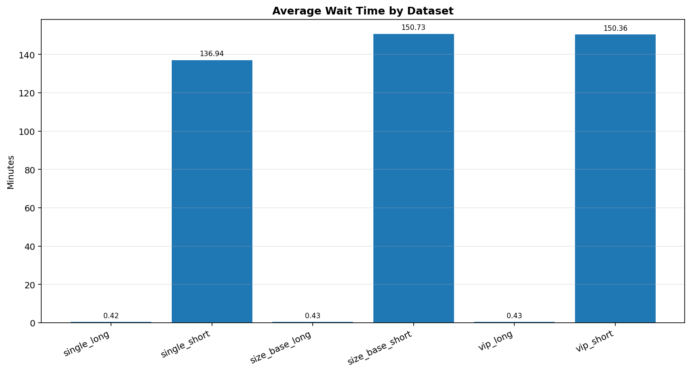

# Final Report 

## Restaurant Queue Simulation Project

### 1. Introduction

Restaurant queue management is a common problem in busy dining environments. A restaurant must decide how to seat customers with different party sizes, arrival times, and service priorities while making efficient use of limited table resources. If the queue is managed poorly, customers may wait too long, tables may remain underused, and the restaurant may lose both revenue and customer satisfaction.

This project addresses that problem through simulation. Instead of designing a front-end reservation system, the project focuses on the operational logic behind restaurant queue management. The main goal is to compare different queue strategies in a unified Python framework and to analyse how strategy choice affects waiting time, seating order, and table utilization.

### 2. Research Background

The research stage of the project was broad and intentionally divided across several queue-management ideas and real-world applications. Based on the materials in the `Research` folder, the project began from four strategic directions.

#### 2.1 Single Snake Queue

The single snake strategy is based on the idea of a single shared waiting line feeding multiple service resources. The research emphasized two major strengths of this approach. First, it reduces the unfairness created when customers choose different lines with different speeds. Second, it improves consistency because all waiting demand is pooled together. The related case study connected this idea to digital queueing practices used in large restaurant brands such as Haidilao.

#### 2.2 VIP Queue

The VIP strategy was studied as a differentiated-service model. Its main purpose is not only operational efficiency but also business prioritization. In this approach, customers with higher value or membership status receive priority when tables become available. The research highlighted the trade-off between commercial value and perceived fairness, and connected this logic to systems such as THE GULU, where priority treatment can coexist with categorized table queues.

#### 2.3 Size-Based / Multi-Queue Strategy

The size-based strategy separates customers according to party size and then matches them to different table categories. This idea was motivated by the inefficiency of seating small groups at oversized tables or forcing large groups to wait unnecessarily when small tables remain idle. The research associated this strategy with digital queueing ecosystems such as Meituan and KeeTa, where segmentation and matching are central to operational efficiency.

#### 2.4 Research Contribution to the Final System

Taken together, the research stage shaped the final implementation in two ways. First, it established the main performance concerns of the project: fairness, waiting time, table utilization, and service priority. Second, it provided the conceptual basis for selecting the three strategies that were actually implemented in code: `single_snake`, `vip`, and `size_base`. In other words, the final code reflects a narrowed and more feasible subset of the original research scope.

### 3. Modeling Approach

The modeling stage translated the research ideas into a simulation structure that could be executed repeatedly on different datasets.

#### 3.1 Basic Entities

The simulation uses two core datasets:

- restaurant data, including `name`, `strategy`, `open_time`, `table_size`, and `table_number`
- customer data, including `index`, `restaurant`, `vip`, `number`, and `arrival_time`

In the current model, restaurant tables are grouped into three abstract categories:

- `A` for small tables
- `B` for medium tables
- `C` for large tables

Customers are then matched to these categories according to group size.

#### 3.2 Time and Service Assumptions

The system adopts a discrete-time simulation. Time advances in integer steps, and all arrivals up to the current time step are processed together. Dining time is estimated during preprocessing using the following formula:

`dinning_time = number * 10 + 20 + random_offset`

This means larger parties are assumed to occupy tables for longer periods. The model is intentionally simplified so that the queue logic remains clear and comparable across strategies.

#### 3.3 Queue-State Design

The central modeling idea is the shared queue state defined in `queue_structure.py`. The `State` class stores:

- occupied tables as min-heaps ordered by leave time
- VIP waiting queues by table type
- non-VIP waiting queues by table type

This design allows the simulation to repeatedly perform three operations:

1. release tables when a dining party leaves
2. add newly arrived customers into the correct queue
3. assign available tables according to the selected strategy

#### 3.4 Strategy Scope

Although the original research considered four strategic directions, the implemented modeling scope was reduced to three executable strategies:

- `single_snake`
- `vip`
- `size_base`

Table sharing remained at the conceptual research level and was not developed into a full simulation module.

### 4. Division of Work

The `Project Plan` shows that the team organized the project around five stages: research, problem modeling, code realization, case studies, and report writing. The work was distributed across four members: Yao Lijia, Yu Wei, Jiang Hongyi, and Zhang Zhanhao.

The planned division of labor can be summarized as follows:

| Member | Planned Research Focus | Planned Modeling / Coding Focus | Planned Report Focus |
|---|---|---|---|
| Yao Lijia | VIP strategy, THE GULU | File input, database management, data model, data generation, Algorithm 1, video demo| Vision, optimization, and data-model explanation |
| Yu Wei | Size-based queue, Meituan / KeeTa | Algorithm 2, sample testing, group report writing | Problem definition, significance, and algorithm explanation |
| Jiang Hongyi | Single snake and table sharing, Meiwei Bu Yong Deng | Algorithm 3, scenario design | Evaluation, limitations, and algorithm explanation |
| Zhang Zhanhao | Single snake strategy, Haidilao | File output, case simulation, output analysis | Comparative analysis and case-simulation explanation |

This planned structure is also reflected in the repository itself. The folder layout moves from `Plan` to `Research`, then to `Modeling&Coding`, `Testing`, and finally `Final_report`, which shows a clear workflow from conceptual planning to implementation and evaluation.

### 5. Code Logic and Implementation

The codebase in `Modeling&Coding` contains the main implementation of the project. Read together with the testing files, it shows that the project developed not only queue algorithms, but also a basic data pipeline, result analysis functions, and visualization scripts.

#### 5.1 Main Program Flow

The executable workflow of the project contains three connected stages: data preparation, simulation execution, and result presentation.

Before the main simulation begins, the project also provides a separate data-generation utility in `Testing/data_generate.py`. This script is used to generate synthetic restaurant and customer CSV files at three scales, namely `small`, `medium`, and `large`. In this sense, the overall pipeline does not begin only from manual or file input; it may also begin from automatically generated testing data prepared in advance for later simulation.

The main simulation entry point is `main.py`. The program first asks the user whether dining time should be random or fixed, and then asks how data should be loaded. The supported input modes are:

- manual input from the console
- CSV input
- default CSV files

After loading data, the program sends the restaurant and customer datasets into the packaging and simulation pipeline. It then performs performance analysis and, at the final stage, generates several visualization outputs.

#### 5.2 Data Input and Preprocessing

The file `io_file.py` is responsible for:

- reading restaurant and customer CSV files
- reading structured console input
- preprocessing dining time
- resetting restaurant open time to the earliest customer arrival
- dispatching each restaurant to the correct queue strategy

The `package()` function is the main controller for strategy execution. It groups data by restaurant, reads the strategy name, calls the corresponding algorithm module, and writes the results back into the customer table. The main output columns are:

- `final_wait_time`
- `start_service_time`
- `leave_time`

These three fields form the basis for later analysis and visualization.

#### 5.3 Shared Queue Structure

The `State` class in `queue_structure.py` is the common infrastructure used by multiple strategies. Occupied tables are stored as min-heaps, while waiting customers are stored in queues. This structure makes it possible to separate strategy logic from state management. Instead of each algorithm managing its own low-level data structures independently, all strategies use the same core representation of queue state.

This design is important because it gives the project a modular structure. It also makes it easier to compare strategies fairly, since they all operate on the same basic customer and table model.

#### 5.4 Implemented Queue Strategies

##### Single Snake

The `strategy_single_snake.py` module creates one global waiting queue for all customers. At each time step, the algorithm checks whether a suitable table is available for each waiting group, beginning with the minimum table size that can accommodate that group. This strategy is the closest implementation of pooled waiting among the implemented modules.

##### VIP

The `strategy_vip.py` module first assigns each customer to a table category according to group size. Within each table type, the algorithm serves the VIP queue before the non-VIP queue. This means priority operates locally inside each table category rather than globally across the whole restaurant.

##### Size-Based

The `strategy_size_base.py` module also assigns customers to table categories according to party size, but does not distinguish VIP customers. Each category therefore follows a standard first-in-first-out rule. Among the three implemented strategies, this one most directly reflects the multi-queue logic developed in the research stage.

#### 5.5 Result Analysis

The file `output_file.py` provides the main numerical analysis layer. For each restaurant, it prints:

- maximum waiting time
- minimum waiting time
- average waiting time
- average occupation rate
- minute-by-minute occupation detail

This means the project already contains the beginnings of an evaluation framework, even though the final case-based comparison has not yet been written into the report.

#### 5.6 Visualization Layer

Several plotting scripts extend the project beyond raw table output:

- `visualise.py` plots occupation rate over time
- `plot_table_utilization_line.py` plots time-series table utilization
- `plot_table_utilization_bar.py` plots average utilization by table type
- `plot_waiting_time_density.py` plots the density of customer waiting times
- `plot_queue_length_over_time.py` plots queue length over time

These files show that the project aimed not only to simulate queue behavior, but also to present it in a form suitable for comparison and interpretation.

#### 5.7 Testing Assets

The `Testing` folder contains both a testing description and a data-generation script. The file `data_generate.py` defines three testing scales:

- `small`
- `medium`
- `large`

The repository already includes generated CSV datasets for all three scales. Based on the current files:

- the small dataset contains 3 restaurants and 194 customer groups
- the medium dataset contains 14 restaurants and 1,806 customer groups
- the large dataset contains 75 restaurants and 15,462 customer groups

This testing setup shows that the project was designed to move beyond toy examples and to explore the behavior of different strategies under larger workloads.

It is therefore more accurate to view `data_generate.py` not as an isolated helper file, but as the first stage of the testing-oriented workflow. It prepares the input data used by the rest of the system and supports repeated simulation under different workload scales.

#### 5.8 Output and Visualization Code

In addition to numerical output printed in the terminal, the project also includes a dedicated visualization layer for the final stage of analysis. After the main simulation is completed, `main.py` calls several plotting modules to present the results in graphical form.

These visualization files include:

- `visualise.py`, which draws occupation-rate curves over time
- `plot_table_utilization_line.py`, which presents table utilization as a time-series line chart
- `plot_table_utilization_bar.py`, which compares average utilization across table types
- `plot_waiting_time_density.py`, which shows the distribution of customer waiting times
- `plot_queue_length_over_time.py`, which visualizes the change of queue length over time

This means that the output stage of the project is not limited to raw simulation records. Instead, the system attempts to transform the results into interpretable charts that make it easier to compare restaurant behavior and strategy performance. From the perspective of the final report, these visualization scripts are important because they provide the basis for future case-study discussion and comparative analysis.

### 6. Case Study and Limitation Analysis

#### 6.1 Case Study Design

The testing stage uses four groups of case studies to examine how the queue strategies behave under different demand conditions. Each case is built around the same basic simulation scale: five restaurants, 200 customer groups per restaurant, and fixed dining time. This gives each tested strategy 1,000 customer groups in total, while keeping the restaurant capacity structure comparable across cases.

The evaluation focuses on the same indicators used by the output and visualization modules:

- average, median, and maximum waiting time
- table occupation rate and table utilization
- queue length over time
- waiting-time distribution

The four case groups are not intended to prove that one strategy is always best. Instead, they show how the same strategy may perform differently when demand pressure, VIP ratio, or party-size distribution changes.

#### 6.2 Baseline Case: Normal Demand

The baseline case uses a normal arrival interval and the standard party-size distribution generated by `data_generate.py`: small groups account for 61.1% of customer groups, medium groups for 18.6%, and large groups for 20.3%. For the VIP strategy, the VIP proportion is about 18.8%; for the single-snake and size-based datasets, VIP status is not used.

This case provides the reference point for later comparisons. Because the customer mix contains all three group-size categories, the simulation tests whether each strategy can make balanced use of A, B, and C table types. In this setting, the single-snake strategy benefits from pooling customers into one shared line, which reduces the risk that one table category is idle while another category has a long queue. The size-based strategy is more structured and easier to interpret, but it depends strongly on whether the generated party-size distribution matches the available table mix. The VIP strategy adds business priority on top of category-based queueing, so its main value is not only lower average waiting time but also differentiated service for selected customers.

The baseline visualization shows that the report should not only compare averages. Waiting-time density and queue-length plots are useful because two strategies may have similar average waiting time while producing different tails. A long tail means that a small number of customers wait much longer than the rest, which is important for perceived fairness and customer satisfaction.

#### 6.3 More VIP Case: Priority Pressure

The MoreVIP case keeps the same restaurant scale, arrival pattern, and party-size distribution as the baseline, but increases the VIP proportion from about 18.8% to 47.4%. This creates a stronger priority-pressure scenario for the VIP strategy.

The main effect of this case is that VIP priority becomes less selective. When almost half of the customers are VIP customers, the priority queue is no longer a small exception to the normal queue; it becomes a major part of total demand. The waiting-time density chart shows clear long-tail behavior in several restaurants, which suggests that some non-priority or poorly matched groups can experience much longer waits.

This result highlights a practical trade-off in VIP queue design. A VIP strategy can support business goals by rewarding high-value customers, but its effectiveness depends on VIP scarcity. If too many customers receive priority, the system may still create congestion while also reducing the perceived fairness of service for ordinary customers. Therefore, a real restaurant using this strategy would need to control the VIP ratio or add extra rules, such as limiting how often VIP customers can bypass ordinary queues.

#### 6.4 More Small Groups Case: Table-Category Bottleneck

The MoreA case changes the customer composition while keeping the same number of restaurants and customer groups. In this dataset, small groups account for 94.4% of all customer groups, medium groups account for 5.6%, and no large groups appear. This creates a concentrated demand pattern for A-type tables.

The processed results show a strong difference between the strategies:

| Strategy | Average waiting time | Median waiting time | Maximum waiting time |
|---|---:|---:|---:|
| Single snake | 3.11 min | 0.00 min | 26.00 min |
| Size-based | 104.05 min | 86.00 min | 358.00 min |
| VIP | 103.56 min | 60.00 min | 363.00 min |

This case is especially useful because it exposes a weakness in strict table-category queueing. When almost all customers are small groups, the size-based and VIP strategies direct most demand into the A-table queue. Even if B or C tables are available, the model's category rules can prevent those tables from fully relieving the A-table bottleneck. As a result, customers wait for A-table capacity even though the restaurant may still have unused larger-table capacity.

The single-snake strategy performs much better in this case because it can make more flexible use of available tables. Its average waiting time is only 3.11 minutes, and the median is 0 minutes, meaning many customers are seated immediately. This does not mean single snake is always superior, but it shows that pooled queueing is robust when demand is heavily concentrated in one party-size category.

#### 6.5 Long vs Short Arrival Intervals: Demand Intensity

The long/short case compares two arrival-pressure settings. The long-interval datasets spread the same total demand over a much wider time window, while the short-interval datasets compress arrivals into a shorter period. The customer mix remains the baseline distribution, with A/B/C groups at 61.1%, 18.6%, and 20.3%.

The summary metrics show a sharp difference:

| Dataset | Strategy | Average waiting time | Median waiting time | Maximum waiting time | Average queue length |
|---|---|---:|---:|---:|---:|
| single_long | single_snake | 0.42 min | 0.00 min | 55.00 min | 0.05 |
| size_base_long | size_base | 0.43 min | 0.00 min | 55.00 min | 0.05 |
| vip_long | vip | 0.43 min | 0.00 min | 55.00 min | 0.05 |
| single_short | single_snake | 136.94 min | 94.00 min | 812.00 min | 31.21 |
| size_base_short | size_base | 150.73 min | 113.50 min | 768.00 min | 35.44 |
| vip_short | vip | 150.36 min | 122.50 min | 758.00 min | 35.40 |

This comparison shows that arrival intensity is one of the strongest drivers of queue performance. Under long arrival intervals, all three strategies perform almost identically, with average waiting time around 0.42 to 0.43 minutes. In this low-pressure setting, strategy choice matters less because tables usually become available before a large queue forms.

Under short arrival intervals, the same restaurant capacity becomes heavily stressed. Average waiting time rises to 136.94 minutes for single snake, 150.73 minutes for size-based, and 150.36 minutes for VIP. The single-snake strategy remains the best of the three in average waiting time, but the large increase across all strategies shows that algorithm choice cannot fully compensate for demand that exceeds service capacity. In real operations, this would suggest the need for capacity expansion, time-slot control, estimated-wait communication, or customer-flow smoothing.

#### 6.6 Limitation Analysis

The case studies are useful for comparing strategy behavior, but several limitations remain. First, all datasets are synthetic. They are helpful for controlled testing, but they cannot fully represent real restaurant behavior, such as meal-period peaks, group cancellations, walk-away customers, or customers changing party size.

Second, the case analysis uses fixed dining time. This makes the strategies easier to compare, but real dining time is variable and affected by menu type, service speed, and customer behavior. A more realistic model would run repeated simulations with random dining time and compare the average result across multiple random seeds.

Third, the current table-category model is rigid. The MoreA case shows that strict matching between party size and table category can create bottlenecks when demand is concentrated in one category. A future version could allow controlled fallback rules, such as seating a small group at a larger table after a maximum waiting threshold.

Fourth, the model assumes all customers eventually wait until they are served. In real restaurants, long waits may cause customers to leave. Adding abandonment behavior would make the queue simulation more realistic and would also change how waiting-time results should be interpreted.

Finally, the available testing outputs are not equally detailed across all cases. The long/short and MoreA cases include processed CSV summaries that support exact numerical comparison, while the baseline and MoreVIP cases rely more heavily on generated figures and input-distribution analysis. For a stronger evaluation, future tests should export the same summary metrics for every case.

### References

ArchDaily. (2024). *Beyond private dining: Exploring the communal table as public space infrastructure*. https://www.archdaily.com/1034907/beyond-private-dining-exploring-the-communal-table-as-public-space-infrastructure

Gorilla Group Limited. (n.d.). *THE GULU official website*. https://web.thegulu.com/

Gross, D., Shortle, J. F., Thompson, J. M., & Harris, C. M. (2018). *Fundamentals of queueing theory* (5th ed.). Wiley.

KeeTa. (n.d.). *KeeTa app*. https://apps.apple.com/hk/app/keeta/id1666524103

Little, J. D. C. (1961). A proof for the queuing formula: L = λW. *Operations Research*.

Meituan. (n.d.). *Official website*. https://about.meituan.com/en

Meituan Tech. (2020). *Meituan delivery dispatch algorithm*. https://tech.meituan.com/2020/07/16/meituan-delivery-dispatch-algorithm.html

Mwee. (n.d.). *Meiwei Bu Yong Deng official website*. https://mwee.cn/

Qminder. (n.d.). *Queueing theory guide*. https://www.qminder.com/blog/queue-management/queuing-theory-guide/

Tiwari, S. K., & Gupta, V. K. (2016). *M/M/S queueing theory model to solve waiting line and to minimize estimated total cost*. *International Journal of Science and Research*.

Wharton Faculty. (2017). *At your service on the table: Impact of tabletop technology on restaurant performance*. https://faculty.wharton.upenn.edu/wp-content/uploads/2017/09/2017.9.10_Tabletop_For_Submission_WithNames.pdf

Wikipedia contributors. (n.d.). *Table sharing*. Wikipedia. https://en.wikipedia.org/wiki/Table_sharing
