# Final Report 

## Restaurant Queue Simulation Project

### Table of Contents

- [1. Introduction](#1-introduction)
- [2. Research Background](#2-research-background)
- [3. Modeling Approach](#3-modeling-approach)
- [4. Division of Work](#4-division-of-work)
- [5. Code Logic and Implementation](#5-code-logic-and-implementation)
- [6. Case Study and Limitation Analysis](#6-case-study-and-limitation-analysis)
  - [6.1 Case Study Design](#61-case-study-design)
  - [6.2 Baseline Case: Normal Demand](#62-baseline-case-normal-demand)
  - [6.3 Baseline vs More VIP Scenario: Priority Pressure](#63-baseline-vs-more-vip-scenario-priority-pressure)
  - [6.4 Baseline vs More Small Groups Scenario: Table-Category Bottleneck](#64-baseline-vs-more-small-groups-scenario-table-category-bottleneck)
  - [6.5 Baseline vs Short/Long Arrival Interval Scenarios: Demand Intensity](#65-baseline-vs-shortlong-arrival-interval-scenarios-demand-intensity)
  - [6.6 Additional Proposed Case Pairs](#66-additional-proposed-case-pairs)
  - [6.7 Limitation Analysis](#67-limitation-analysis)
- [7. Topic C Requirements Checklist](#7-topic-c-requirements-checklist)
- [References](#references)

### Submission Links

- GitHub Repository: https://github.com/bobownYAO/COMP1110_Project_2026
- Demo Video: To be added

### 1. Introduction

Restaurant queue management is a common problem in busy dining environments. A restaurant must decide how to seat customers with different party sizes, arrival times, and service priorities while making efficient use of limited table resources. If the queue is managed poorly, customers may wait too long, tables may remain underused, and the restaurant may lose both revenue and customer satisfaction.

This project addresses that problem through simulation. Instead of designing a front-end reservation system, the project focuses on the operational logic behind restaurant queue management. The main goal is to compare different queue strategies in a unified Python framework and to analyse how strategy choice affects waiting time, seating order, and table utilization.

### 2. Research Background

The research stage of the project was broad and intentionally divided across several queue-management ideas and real-world applications. Each team member investigated a distinct strategic direction, examining both the theoretical foundations and practical implementations in modern restaurant systems. The materials in the `Research` folder reveal four complementary research streams that together establish the conceptual framework for the simulation project.

The main research comparison is summarized below, using the Topic C criteria of waiting time, utilization, fairness, peak-hour behavior, and operational complexity.

| Strategy / approach | Expected wait-time effect | Table-utilization effect | Fairness and customer perception | Peak-hour behavior | Operational complexity | Main limitation in this project |
|---|---|---|---|---|---|---|
| Single snake queue | Reduces mismatch delay by pooling all waiting groups into one line. | Can use spare larger-table capacity for smaller groups, improving flexibility. | Strong FCFS fairness because one visible order is maintained. | Most resilient in the tested compressed-arrival scenarios. | Simple for customers and staff to understand. | A long visible queue may look intimidating, and large parties can still wait if large tables are scarce. |
| Size-based queues | Can reduce wait when each group-size category has matching table supply. | Efficient when demand mix matches table mix, but rigid when one category dominates. | Fair within each size queue, but later small groups may be seated before earlier large groups. | Vulnerable when one table category becomes a bottleneck. | Moderate: staff must manage several queues. | Strict category matching can leave tables idle while another queue grows. |
| VIP priority queue | Reduces wait for high-priority customers in the same table category. | Does not increase physical capacity, so total throughput may remain unchanged. | Commercially useful but may reduce perceived fairness for non-VIP customers. | Priority can reshuffle service order but cannot solve capacity bottlenecks. | Higher: staff must define and explain priority rules. | If many customers are VIP, the priority advantage is diluted. |
| Table sharing (conceptual only) | Could reduce waits by filling unused seats at partially occupied tables. | Potentially high utilization because empty seats can be reused. | Depends heavily on culture and communication; some customers may dislike sharing. | Useful in dense restaurants and food halls. | High: needs seat-level tracking and social/operational rules. | Researched but not implemented; the simulation keeps one group per table for simplicity. |

#### 2.1 Single Snake Queue Strategy

**Theoretical Foundation and Mathematical Logic**

The single snake strategy is rooted in pooling theory and the mathematical efficiency of the M/M/s queueing model, first formalized by Erlang in 1909. Instead of maintaining separate lines for each service resource, all customer demand is pooled into one shared buffer—the "snake." This design eliminates server idling, where one service point remains free while customers wait in a different, slower-moving line. The primary operational goal is consistency: by removing the "bad luck factor" of choosing the wrong line, the single snake reduces variance in waiting time and creates a strict First-Come, First-Served (FCFS) experience that customers perceive as fundamentally fair.

**Psychological and Operational Advantages**

From a psychological perspective, humans tolerate waiting more easily when the process follows transparent FCFS logic. Seeing someone who arrived later get served first creates significant service-related stress. The single snake eliminates this anxiety by making the queue order visible and unambiguous. Operationally, the strategy maximizes throughput by ensuring servers are constantly fed the next customer, and it eliminates line-switching behavior (jockeying) that disrupts flow in multi-line systems.

However, the strategy also presents challenges. A single long line can appear more intimidating than several short ones, potentially causing balking—customers refusing to join what looks like an overwhelming queue. Additionally, the physical space required to accommodate a serpentine path can create lobby congestion, and the pooled system makes it harder to hide slower or trainee staff members whose performance directly affects the entire queue.

**Modern Digital Implementation: Haidilao Case Study**

The research examined Haidilao's pioneering transition from physical lines to a virtual serpentine queue integrated into their WeChat Mini Program. This system manages over 100 million members globally and handles approximately 48% of all dine-in bookings. Key features include geofenced queueing (customers can only join if within a specific radius), real-time status tracking with live countdown displays, and a tiered priority system for high-value "Black Sea" members that creates parallel snakes with different weights feeding the same table pool.

Haidilao's "lobby buffer" strategy addresses the challenge of digital queue management: while customers can wander away to shop or walk, the physical lobby serves as a final staging area where customers pre-order via QR codes, syncing their selections to the kitchen before seating. This increases table turnover rates to over 4.0x per day. The lobby also provides free snacks, manicures, and games to prevent reneging (customers leaving the queue). The system uses predictive analytics to forecast table clear times and automatically cancels no-shows, instantly advancing the next person in the snake.

**Current Applications**

Beyond Haidilao, the single snake has evolved into specialized formats across the restaurant industry: fast-casual assembly lines like Chipotle where the queue is the service path, high-volume quick-service restaurants using a single line feeding multiple self-service kiosks, and boutique bakeries where the winding line allows customers to view displays while waiting, reducing transaction time when they reach the counter.

#### 2.2 VIP Priority Queue Strategy

**Concept Evolution and Historical Context**

The VIP priority queueing concept originated from the British term "Very Important Person," first emerging around 1933 and gaining administrative significance during World War II for identifying senior military personnel and diplomats requiring priority transportation. Post-war civilian aviation adopted this concept, offering lounges and priority services to distinguished guests. In the food and beverage sector, the strategy evolved from informal host-discretion models to modern algorithmic, data-driven frameworks where time became a proxy for value alongside food quality and service.

**Strategic Scope and Best Use Cases**

VIP queuing proves most effective in fine-dining establishments targeting "gourmet foodies" and influencers who contribute 20-50% of revenue and drive word-of-mouth promotion; high-demand urban venues where demand significantly exceeds capacity, causing balking or reneging; high-turnover casual dining such as Japanese all-you-can-eat or hotpot restaurants managing dense crowds while ensuring regulars receive consistent experiences; and medium-sized restaurants seeking to reduce on-site congestion and lower customer churn by up to 30%.

**Trade-offs and Modeling Logic**

The VIP strategy presents a fundamental trade-off between commercial value and perceived fairness. While it stabilizes wait times for high-value customer segments and reduces balking among profitable customers, it may increase wait times for regular customers and risks "starvation" when VIP arrival rates exceed system thresholds. Virtual queues can hide queue-jumping and reduce unfairness perception, but visible VIP priority creates negative utility proportional to the wait time differential experienced by regular customers.

The research identified two priority system types: non-preemptive priority, where VIPs can pass regular customers but cannot interrupt a meal in progress, and preemptive priority, applicable to kitchen operations rather than physical seating. Many restaurants employ a 3:1 ratio heuristic—seating three regular parties for every one VIP party—to maintain system stability. This is supported by weighted resource allocation models where VIP queue weight might be set at 10 versus 1 for regular queues, providing disproportionate but not absolute capacity share.

The total cost function for determining VIP thresholds is expressed as:
```
C = c₁λ₁E(W₁) + c₂λ₂E(W₂)
```
where c₁ and c₂ represent waiting costs for VIP and regular customers, λ₁ and λ₂ are arrival rates, and E(W₁) and E(W₂) are expected wait times. Key simulation parameters include a VIP-to-Regular arrival ratio of approximately 1:9, customer patience that decreases with queue position, and informational transparency through real-time updates that increases patience thresholds.

**Real-World Implementation: THE GULU Platform**

THE GULU, developed by Gorilla Group Limited and launched in Hong Kong in 2014, exemplifies comprehensive VIP queue management in practice. The platform serves over 2,000 restaurant partners including Maxim's Group (400+ restaurants) and targets both busy Hong Kong citizens optimizing their time and F&B merchants digitizing floor management. A defining milestone was its COVID-19 pandemic pivot, achieving peak 1.28 million simultaneous logins for mask queueing in early 2020.

THE GULU implements multi-category table queuing (Categories A through D for party sizes 1-2, 3-4, 5-6, and 7+ persons respectively), with queues processed in parallel so small tables can serve Category A tickets even if Category B has older tickets. The platform's Fast-Lane VIP services integrate with merchant loyalty databases, managing priority users through a virtual fast-track that inserts VIPs at specific offsets from the front of the queue.

The technical infrastructure relies on Tencent Cloud for container orchestration with horizontal pod autoscaling for traffic spikes, TencentDB for Redis handling over 1 million transactions per hour with millisecond latency, WebSocket for persistent bidirectional TCP connections enabling real-time push updates, and Golang goroutines for lightweight concurrent connections supporting thousands of simultaneous sessions.

Operational impact data shows THE GULU reduces on-site congestion by 50%, decreases order remake rates from approximately 12% to under 3% through digital integration, increases table turnover by 15%, and provides real-time analytics replacing anecdotal intuition. Staff manage hybrid queues (walk-ins via kiosk plus remote app users) using handheld POS devices synced with a centralized queue manager.

#### 2.3 Size-Based Multi-Queue Strategy

**Evolution from FIFO Limitations**

The multi-size queueing concept evolved from the limitations of traditional First-In, First-Out (FIFO) single-line systems in restaurant management. The older model often led to inefficient table utilization, where a party of two might occupy a table for four, or a large group would wait indefinitely while smaller tables sat empty. The modern strategy, pioneered by digital platforms like Meituan, represents a "divide and conquer" framework that segments customers into parallel virtual queues based on party size (e.g., Small, Medium, Large), matching them to corresponding table inventories. This shifts the core logic from a simple chronological sequence to a dynamic resource-optimization problem, maximizing table turnover and customer throughput.

**Strategic Advantages and Challenges**

Multi-size queuing proves most effective in high-turnover casual dining where maximizing seat utilization per hour is critical (e.g., ramen shops, fast-casual chains), family-style restaurants with diverse table size mixes (2-tops, 4-tops, 8-tops) catering to varied group demographics, high-demand urban venues where physical queue space is limited and reducing on-site congestion is a priority, and large-scale establishments such as Chinese dim sum restaurants or hotpot chains managing hundreds of waiting customers.

The strategy significantly reduces average wait time by matching parties to appropriate tables efficiently and increases overall table turnover rate by 15-20% by minimizing idle time and size mismatches. It enhances "perceived fairness" as customers see queues for other party sizes moving independently. However, it can lead to "starvation" for less common party sizes (e.g., large-party queues) if their corresponding tables are few. "Downgrade matching"—seating a 2-person party at a 4-top—can reduce potential revenue during peak hours, and the system requires clear communication to manage expectations when a later-arriving small party is seated before an earlier large party.

**Algorithmic Policies and Modeling Logic**

The system operates on a minimum of three parallel, non-blocking queues, each tied to specific table inventory:
- S-Queue (1-2 persons) → Small Tables
- M-Queue (3-4 persons) → Medium Tables  
- L-Queue (5+ persons) → Large Tables / Combinable Tables

Key algorithmic policies include downgrade matching, where if S-Queue wait time exceeds a set threshold (e.g., 15 minutes) and an M-Table is idle, the system suggests seating the S-Queue party at the M-Table; predictive calling, where the system monitors seated tables' dining progress and pre-emptively calls the next party when a table enters the "payment" state to minimize idle time; and dynamic table combination for the L-Queue, where if no large table is free, the algorithm scans for adjacent free S or M tables and suggests physical combination to staff.

The table utilization cost function conceptually represents the system's optimization goal:
```
Minimize C = w₁ × T_idle + w₂ × N_mismatch
```
where C is total operational cost/inefficiency, T_idle is the sum of idle minutes for all tables, N_mismatch is the number of parties seated at oversized tables, and w₁, w₂ are weighting factors for idle time versus mismatch inefficiency.

**Platform Implementation: Meituan and KeeTa Dispatch Systems**

Meituan, founded in 2010, dominates Chinese food delivery and local services through a sophisticated real-time logistics and dispatch system often called the "Super Brain." KeeTa, launched in Hong Kong in 2023, is Meituan's global-facing brand deploying this mature technology to new markets. The system targets a three-sided marketplace: users seeking convenience and speed, merchants aiming to expand reach, and riders looking to maximize income through efficient order fulfillment.

Core features include dynamic load balancing that constantly analyzes real-time order volume against available rider capacity in geographical cells, intelligent order bundling that automatically groups orders with nearby restaurants and delivery destinations into single trips during medium-load periods, surge pricing and throttling that dynamically increases delivery fees and rider bonuses during high-load scenarios while potentially making some restaurants temporarily unavailable to prevent system collapse, and an ETA prediction engine using machine learning to provide accurate estimated arrival times by factoring restaurant prep time, real-time traffic, weather, and rider location.

The technical infrastructure relies on cloud infrastructure (Tencent/AWS) for massive auto-scaling compute power handling city-wide concurrent dispatch calculations, real-time GIS and geofencing for precise location tracking and operational zone definition, in-memory databases (Redis) for millisecond-latency access to order statuses and queue data, and machine learning engines (TensorFlow) powering core dispatch algorithms, ETA predictions, and route optimization.

Operational impact shows the system reduces average delivery time from 45-60 minutes to approximately 30 minutes, increases rider efficiency from 10-15 orders per day to 30-50+ orders per day, enables system throughput of millions of orders per hour compared to manual dispatcher limitations, and provides real-time dashboards on order density and rider performance replacing manual processes.

#### 2.4 Table Sharing Strategy (Conceptual Research)

**Historical and Cultural Context**

Table sharing is defined as the practice of seating multiple separate parties—individual customers or groups—who are previously unacquainted at the same restaurant table. Historically, this custom has roots in diverse cultural rituals: from Greek symposia and medieval feasts to the communal tables of European bakeries. In East Asia, especially in Japan and Hong Kong, table sharing evolved as a routine necessity of high-density urban life. In modern hospitality, the concept has transitioned from a rustic necessity into a high-performance operational strategy used to mitigate high urban rents and meet the demands of younger consumers who seek social connectivity and shared experiences. Today, communal tables are viewed as "public space infrastructure" that facilitates social interaction while maximizing seat utilization.

**Best Use Cases and Trade-offs**

Table sharing proves most effective in cafes and bakeries where it creates an inviting atmosphere and encourages social interactions, fast-casual chains like Wagamama and Le Pain Quotidien utilizing long communal benches to prioritize high-volume flow and speed, dim sum halls and urban food halls in high-density environments relying on table sharing to handle massive peak-hour crowds, and waiting areas with pub tables managing guests before they move to private dining.

The strategy offers significant advantages: seating guests at shared tables is faster than waiting for private tables to clear, unseated seats created when small groups occupy large tables can be utilized, it provides a "social spark" and sense of belonging to a larger community, and it boosts revenue by allowing more customers per shift without increasing footprint. However, disadvantages include potential frustration and anxiety if staff do not communicate clearly about sharing expectations, inefficient seating layouts can still occur leaving single empty seats hard to fill, cultural resistance is high in Western markets where personal space and independence are prioritized, and the noise and crowding of shared environments may result in customer loss.

**Modeling Logic and Implementation Framework**

To simulate or implement table sharing effectively, the modeling logic requires defining entities for customer groups (size, arrival time, dining duration) and tables (capacity and current occupancy status), queue segmentation assigning arriving groups to matching queues based on party size ranges (1-2, 3-4, 5+ people), allocation logic that identifies and seats the earliest-waiting group from the matching queue whenever a seat or table becomes available, event-based or step-by-step advancement to process arrivals and update dining status as groups finish, and performance tracking computing metrics such as average/max wait time, max queue length, table utilization percentage, and service level (percentage of groups seated within target time).

**Real-World Platform: Meiwei Bu Yong Deng**

"Meiwei Bu Yong Deng" (MWBYD) is a prominent smart dining service provider in China specializing in B2B SaaS products and C-end consumer applications. Founded in January 2013 by Xie Xinfa, a former ZTE engineer, the company was born from the insight that queuing is the most effective scenario to connect restaurants with consumers. Within five years, it covered over 200 cities and partnered with more than 100,000 restaurants, serving nearly 80 million diners monthly.

Core features include multi-channel queuing supporting remote ticket collection via app, WeChat official accounts, and third-party platforms allowing guests to join lines from home or office; real-time status tracking where diners scan QR codes on tickets to see exact queue position and estimated wait times; pre-ordering food allowing customers to select dishes while waiting with synchronization to the kitchen to increase table turnover and reduce walk-out rates; and queue incentives where restaurants add "waiting discounts" or coupons to the queuing interface to retain customers.

The underlying technology stack includes SaaS (Software as a Service) cloud-based architecture for rapid deployment and iterative updates across thousands of locations without high hardware costs, big data analytics for precise customer profiling and scientific site selection for new restaurant branches, Internet of Things (IoT) integrating smart terminals (POS, printers, audio systems) ensuring seamless data flow between front desk and kitchen, and cloud computing facilitating real-time synchronization of queuing data across different mobile and web interfaces.

Operational impact shows MWBYD transforms the wait time experience from customers staying near the door (perceived as stressful) to remote queuing greatly reducing anxiety, improves labor efficiency by automating procedures that staff previously managed manually, and increases customer retention by providing transparent queue status and pre-order functions compared to high walk-out rates in traditional manual systems.

#### 2.5 Research Contribution to the Final System

Taken together, the four research streams shaped the final implementation in several critical ways. First, they established the main performance concerns of the project: fairness (ensuring customers perceive the queue as just), waiting time (minimizing customer burden), table utilization (maximizing resource efficiency), and service priority (balancing commercial value with operational flow). Second, they provided the conceptual basis for selecting the three strategies that were actually implemented in code: `single_snake`, `vip`, and `size_base`.

The single snake research contributed the pooling logic and FCFS fairness principle that became the foundation of the `single_snake` implementation. The VIP research provided the priority queue structure and the non-preemptive priority model that informed the `vip` strategy's design. The size-based research established the parallel queue architecture and downgrade matching logic that shaped the `size_base` implementation. The table sharing research, while not developed into a full simulation module, influenced the conceptual understanding of table capacity flexibility and the trade-offs between strict matching rules and adaptive seating policies.

In other words, the final code reflects a narrowed and more feasible subset of the original research scope. The research stage was intentionally broad, exploring both implemented strategies (single snake, VIP, size-based) and conceptual directions (table sharing) to establish a comprehensive understanding of the restaurant queue management problem space. The modeling and coding stages then focused on the three strategies most amenable to discrete-event simulation with the available data structures and time constraints, while the research foundation ensured these implementations were grounded in real-world applications and theoretical principles from queueing theory.

### 3. Modeling Approach

The modeling stage translated the research ideas into a simulation structure that could be executed repeatedly on different datasets.

#### 3.1 Modeling Assumptions

The implementation intentionally uses a simplified model so that the three queue strategies can be compared under controlled conditions:

- Tables are grouped into fixed `A`, `B`, and `C` categories.
- No table sharing is used in the implemented simulation; one customer group occupies one table.
- Customers do not cancel, walk away, change party size, or make reservations.
- Every arriving group eventually waits until it is served.
- Time advances in discrete integer steps rather than real time.
- Dining time is calculated from group size, with an optional random offset.
- `vip` priority is applied only within the same table category, not globally across all table types.
- The simulation records the actual `assigned_table_type` used for each served group so utilization can be calculated from real seating decisions.

#### 3.2 Basic Entities

The simulation uses two core datasets:

- restaurant data, including `name`, `strategy`, `open_time`, `table_size`, and `table_number`
- customer data, including `index`, `restaurant`, `vip`, `number`, and `arrival_time`

In the current model, restaurant tables are grouped into three abstract categories:

- `A` for small tables
- `B` for medium tables
- `C` for large tables

Customers are then matched to these categories according to group size.

#### 3.3 Time and Service Assumptions

The system adopts a discrete-time simulation. Time advances in integer steps, and all arrivals up to the current time step are processed together. Dining time is estimated during preprocessing using the following formula:

`dinning_time = number * 10 + 20 + random_offset`

This means larger parties are assumed to occupy tables for longer periods. The model is intentionally simplified so that the queue logic remains clear and comparable across strategies.

#### 3.4 Queue-State Design

The central modeling idea is the shared queue state defined in `queue_structure.py`. The `State` class stores:

- occupied tables as min-heaps ordered by leave time
- VIP waiting queues by table type
- non-VIP waiting queues by table type

This design allows the simulation to repeatedly perform three operations:

1. release tables when a dining party leaves
2. add newly arrived customers into the correct queue
3. assign available tables according to the selected strategy

#### 3.5 Strategy Scope

Although the original research considered four strategic directions, the implemented modeling scope was reduced to three executable strategies:

- `single_snake`
- `vip`
- `size_base`

Table sharing remained at the conceptual research level and was not developed into a full simulation module.

### 4. Division of Work

The `Project Plan` shows that the team organized the project around five stages: research, problem modeling, code realization, case studies, and report writing. The work was distributed across four members: Yao Lijia, Yu Wei, Jiang Hongyi, and Zhang Zhanhao.

The planned division of labor can be summarized as follows:

| Member | Planned Research Focus | Planned Modeling / Coding Focus | Planned Report Focus |
|---|---|---|---|
| Yao Lijia | VIP strategy, THE GULU | File input, database management, data model, data generation, Algorithm 1, video demo| Vision, optimization, and data-model explanation |
| Yu Wei | Size-based queue, Meituan / KeeTa | Algorithm 2, sample testing, group report writing | Problem definition, significance, and algorithm explanation |
| Jiang Hongyi | Single snake and table sharing, Meiwei Bu Yong Deng | Algorithm 3, scenario design | Evaluation, limitations, and algorithm explanation |
| Zhang Zhanhao | Single snake strategy, Haidilao | File output, case simulation, output analysis | Comparative analysis and case-simulation explanation |

This planned structure is also reflected in the repository itself. The folder layout moves from `Plan` to `Research`, then to `Modeling&Coding`, `Testing`, and finally `Final_report`, which shows a clear workflow from conceptual planning to implementation and evaluation.

### 5. Code Logic and Implementation

The codebase in `Modeling&Coding` contains the main implementation of the project. Read together with the testing files, it shows that the project developed not only queue algorithms, but also a basic data pipeline, result analysis functions, and visualization scripts.

#### 5.1 Main Program Flow

The executable workflow of the project contains three connected stages: data preparation, simulation execution, and result presentation.

Before the main simulation begins, the project also provides a separate data-generation utility in `Testing/data_generate.py`. This script is used to generate synthetic restaurant and customer CSV files under configurable strategy, restaurant-count, customer-count, VIP-ratio, group-size, and arrival-interval settings. In this sense, the overall pipeline does not begin only from manual or file input; it may also begin from automatically generated testing data prepared in advance for later simulation.

The main simulation entry point is `main.py`. The program can still be used interactively: it first asks the user whether dining time should be random or fixed, and then asks how data should be loaded. The supported input modes are:

- manual input from the console
- CSV input with explicit restaurant and customer file paths

For reproducibility, the same entry point also supports command-line CSV execution with explicit restaurant file, customer file, dining-time mode, and output directory arguments. This makes it possible for a TA to rerun a case study without manually typing file paths into the console.

After loading data, the program sends the restaurant and customer datasets into the packaging and simulation pipeline. It then performs performance analysis and, at the final stage, generates several visualization outputs.

#### 5.2 Data Input and Preprocessing

The file `io_file.py` is responsible for:

- reading restaurant and customer CSV files
- reading structured console input
- validating required columns, numeric fields, strategies, table categories, and restaurant references
- preprocessing dining time
- resetting restaurant open time to the earliest customer arrival
- dispatching each restaurant to the correct queue strategy

During preprocessing, the project now records the correctly spelled `dining_time` column and also keeps the original `dinning_time` column as a backward-compatible alias for the existing strategy modules. Both columns represent the same modeled dining duration.

The `package()` function is the main controller for strategy execution. It groups data by restaurant, reads the strategy name, calls the corresponding algorithm module, and writes the results back into the customer table. The main output columns are:

- `final_wait_time`
- `start_service_time`
- `leave_time`
- `assigned_table_type`

These fields form the basis for later analysis and visualization. The `assigned_table_type` field is especially important for Single Snake because a smaller group may be seated at a larger available table.

#### 5.3 Shared Queue Structure

The `State` class in `queue_structure.py` is the common infrastructure used by multiple strategies. Occupied tables are stored as min-heaps, while waiting customers are stored in queues. This structure makes it possible to separate strategy logic from state management. Instead of each algorithm managing its own low-level data structures independently, all strategies use the same core representation of queue state.

This design is important because it gives the project a modular structure. It also makes it easier to compare strategies fairly, since they all operate on the same basic customer and table model.

#### 5.4 Implemented Queue Strategies

##### Single Snake

The `strategy_single_snake.py` module creates one global waiting queue for all customers. At each time step, the algorithm checks whether a suitable table is available for each waiting group, beginning with the minimum table size that can accommodate that group. This strategy is the closest implementation of pooled waiting among the implemented modules.

##### VIP

The `strategy_vip.py` module first assigns each customer to a table category according to group size. Within each table type, the algorithm serves the VIP queue before the non-VIP queue. This means priority operates locally inside each table category rather than globally across the whole restaurant.

##### Size-Based

The `strategy_size_base.py` module also assigns customers to table categories according to party size, but does not distinguish VIP customers. Each category therefore follows a standard first-in-first-out rule. Among the three implemented strategies, this one most directly reflects the multi-queue logic developed in the research stage.

#### 5.5 Result Analysis

The file `output_file.py` provides the main numerical analysis layer. For each restaurant, it prints:

- maximum waiting time
- minimum waiting time
- average waiting time
- number of served and unserved groups
- average and maximum queue length
- average occupation rate
- minute-by-minute occupation detail

In this report, `occupation_rate` means currently dining people divided by total seats. `table_utilization` refers to table or table-category usage as reported by the utilization plotting modules. Keeping these terms separate avoids confusing seat occupancy with table-category usage.

The same analysis also produces `outputs/summary_metrics_by_restaurant.csv`, which gives a reproducible numerical summary for each restaurant run.

#### 5.6 Visualization Layer

Several plotting scripts extend the project beyond raw table output:

- `plot_occupation.py` plots occupation rate over time
- `plot_table_utilization_line.py` plots time-series table utilization
- `plot_table_utilization_bar.py` plots average utilization by table type
- `plot_waiting_time_density.py` plots the density of customer waiting times
- `plot_queue_length_over_time.py` plots queue length over time

These files show that the project aimed not only to simulate queue behavior, but also to present it in a form suitable for comparison and interpretation.

#### 5.7 Testing Assets

The `Testing` folder contains a testing description, scenario-based datasets, generated output charts, a data-generation script, and input-validation sample cases. The main scenario folders include baseline comparison, higher VIP ratio, more small groups, and long/short arrival intervals.

The file `data_generate.py` is used to create synthetic restaurant and customer CSV files from interactive choices. It allows the team to vary the queue strategy, number of restaurants, number of customers, VIP probability, group-size distribution, and arrival interval mode.

The repository also includes pytest-based sample cases for input validation. These tests check that valid files can be loaded and that malformed inputs, such as missing columns, invalid strategies, invalid table types, invalid numeric values, and unknown restaurant references, are rejected before the simulation begins.

This testing setup shows that the project was designed to move beyond toy examples and to explore the behavior of different strategies under controlled scenarios. It is therefore more accurate to view `data_generate.py` and the sample test cases as supporting parts of the simulation workflow rather than isolated helper files.

#### 5.8 Output and Visualization Code

In addition to numerical output printed in the terminal, the project also includes a dedicated visualization layer for the final stage of analysis. After the main simulation is completed, `main.py` calls several plotting modules to present the results in graphical form.

These visualization files include:

- `plot_occupation.py`, which draws occupation-rate curves over time
- `plot_table_utilization_line.py`, which presents table utilization as a time-series line chart
- `plot_table_utilization_bar.py`, which compares average utilization across table types
- `plot_waiting_time_density.py`, which shows the distribution of customer waiting times
- `plot_queue_length_over_time.py`, which visualizes the change of queue length over time

This means that the output stage of the project is not limited to raw simulation records. Instead, the system attempts to transform the results into interpretable charts that make it easier to compare restaurant behavior and strategy performance. From the perspective of the final report, these visualization scripts are important because they provide the basis for future case-study discussion and comparative analysis.

### 6. Case Study and Limitation Analysis

#### 6.1 Case Study Design

The testing stage uses four groups of case studies to examine how the queue strategies behave under different demand conditions. Each case is built around the same basic simulation scale: five restaurants, 200 customer groups per restaurant, and fixed dining time. This gives each tested strategy 1,000 customer groups in total, while keeping the restaurant capacity structure comparable across cases.

The evaluation focuses on the same indicators used by the output and visualization modules:

- average, median, and maximum waiting time
- table occupation rate and table utilization
- queue length over time
- waiting-time distribution

The four case groups are not intended to prove that one strategy is always best. Instead, they use the normal-demand baseline as the reference condition, then vary one main scenario pressure at a time: VIP ratio, group-size mix, or arrival intensity. This baseline-centered structure is the way the project satisfies the Topic C requirement for controlled scenario comparisons.

The table below summarizes the evaluation design. "Baseline" means the normal-demand setting with five restaurants, 200 customer groups per restaurant, fixed dining time, and the default group-size distribution. The other scenario groups are interpreted as variants of that baseline.

| Scenario comparison | Baseline/reference condition | Scenario change | Input evidence | Main metrics | Purpose |
|---|---|---|---|---|---|
| Baseline strategy comparison | Normal-demand baseline for `single_snake`, `size_base`, and `vip` | Queue strategy differs while scale and normal arrival pressure stay fixed | `Testing/Baseline/` | Wait time, occupation rate, table utilization, queue length | Establish the reference behavior of the three implemented strategies. |
| Baseline vs MoreVIP | Baseline VIP case with about 20% VIP customers | VIP proportion increases to about 50%, with the same strategy family and capacity scale | `Testing/Baseline/testdata_customer_vip_5r_200c_normal.csv`, `Testing/MoreVIP/testdata_customer_vip_5r_200c_normal.csv` | Average wait, queue length, utilization | Test whether adding more priority customers improves global performance or only changes service order. |
| Baseline vs MoreA | Baseline group-size mix under normal arrival pressure | Small groups become dominant, creating a category-imbalance stress case | `Testing/Baseline/`, `Testing/Testdata-MoreA/` | Table-type utilization, wait time, queue length | Test whether rigid table-category matching wastes capacity when one group type dominates demand. |
| Baseline vs Short arrivals | Baseline/medium arrival intensity | Arrival intervals become compressed, creating high-pressure demand | `Testing/Testdate-longshort/testdata_*_short.csv`, summary metrics CSV | Average wait, average queue length, max queue length | Measure high-pressure resilience against queue build-up. |
| Baseline vs Long arrivals | Baseline/medium arrival intensity | Arrival intervals become more dispersed, creating low-pressure demand | `Testing/Testdate-longshort/testdata_*_long.csv`, summary metrics CSV | Average wait, queue length, occupation rate | Confirm whether strategy choice still matters when demand is easy to absorb. |
| Short-arrival strategy comparison | Same short-arrival stress condition | Strategy differs under the same high-pressure setting | `Testing/Testdate-longshort/restaurant_run_outputs_latest_long_short_fast/summary_metrics_by_dataset.csv` | Average wait, average queue length, max queue length | Identify which strategy is most resilient after the baseline-to-short stress shift. |

| Scenario comparison | Same scale? | One main changed factor? | How it supports Topic C |
|---|---|---|---|
| Baseline strategy comparison | Yes | Queue strategy | Provides the reference strategy comparison before scenario stress is added. |
| Baseline vs MoreVIP | Yes | VIP ratio | Shows the effect of changing customer priority composition. |
| Baseline vs MoreA | Yes | Group-size distribution | Shows the effect of changing demand mix while retaining the same simulation scale. |
| Baseline vs Short arrivals | Yes | Arrival intensity | Shows high-pressure behavior relative to the medium baseline. |
| Baseline vs Long arrivals | Yes | Arrival intensity | Shows low-pressure behavior relative to the medium baseline. |
| Short-arrival strategy comparison | Yes | Queue strategy under a fixed stress case | Complements the baseline comparison by showing strategy robustness under compressed demand. |

#### 6.2 Baseline Case: Normal Demand

##### 1. Executive Summary for This Part

This report presents a technical evaluation of three queuing strategies— Single Snake ,  Size-based , and  VIP Priority —benchmarked against varying arrival densities. The analysis adopts a dual-lens framework:  High-Pressure Resilience  (evaluating performance during compressed arrival waves) and  Low-Pressure Efficiency  (evaluating flow during dispersed arrivals).

Key Findings:

* High-Pressure Resilience:  Single Snake is the most robust strategy for concentrated arrivals. It demonstrates superior resilience by suppressing waiting-time escalation, maintaining an average wait of 136.94 minutes compared to the >150-minute averages seen in Size-based and VIP strategies.
* Low-Pressure Efficiency:  Under dispersed conditions, strategy choice becomes secondary to operational simplicity. All strategies achieve near-zero waiting (~0.42 minutes), indicating that the system possesses sufficient capacity to absorb demand regardless of the queuing rule.
* Strategic Conclusion:  Single Snake is recommended as the "safest default." It provides critical protection against "runaway" congestion during peak waves without incurring any performance penalties during off-peak periods.

##### 2. Analytical Framework

To evaluate these strategies, we prioritize customer-side outcomes over mere resource allocation. The following metrics serve as the primary diagnostic tools:

| Metric | Significance | Interpretation Criteria |
| ------ | ------ | ------ |
| Average Wait Time | Direct quantitative measure of customer-side friction. | Lower is better, specifically under short-interval pressure. |
| Average Queue Length | Indicates the stability of the system. | Smaller, shorter-lived queues indicate higher strategy resilience. |
| Waiting-time Density | Visualizes the distribution of the customer experience. | The left side of the distribution matters more than a single mean ; higher density at low wait times is preferred. |
| Table Utilization | A diagnostic variable for resource flow. | Used to identify bottlenecks; high values explain why congestion occurs. |

##### 3. Resource Utilization Efficiency

Analysis of physical capacity occupancy reveals that utilization is a diagnostic indicator rather than a primary performance measure.

* Occupation Rates (Restaurant 1):  In the baseline scenario, Single Snake maintains a 62.9% occupation rate, while Size-based and VIP Priority strategies utilize a higher 65.2%.
* Critical Resource Bottleneck:  Regardless of the strategy, Table Type C is a persistent bottleneck. Its utilization consistently exceeds 90%, specifically ranging from  91.9% to 95.3%  in Restaurant 1. This extreme utilization explains the persistence of queues even when Table Types A or B remain available.

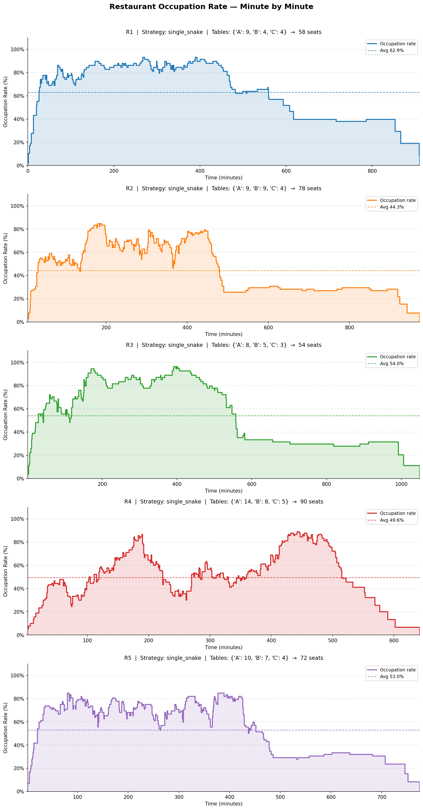
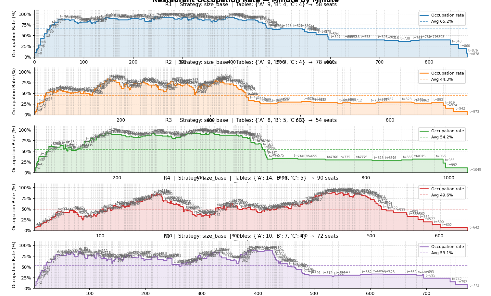
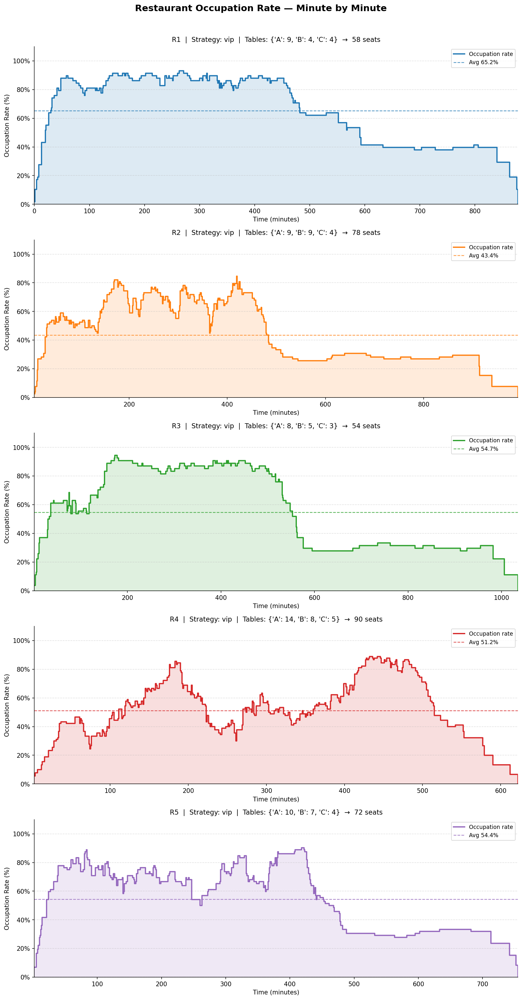

##### 4. Queue & Waiting Experience

A comparative analysis across arrival densities reveals how Single Snake suppresses the escalation of wait times during the transition from baseline to high-pressure conditions.

| Strategy | Baseline (Medium) | High-Pressure (Short) | Growth Rate (%) |
| ------ | ------ | ------ | ------ |
| Single Snake | 42.67 min | 136.94 min | +220.9% |
| Size-based | 45.55 min | 150.73 min | +230.9% |
| VIP Priority | 45.40 min | 150.36 min | +231.2% |

Analytical Synthesis:

* Specific Performance (R3):  In Restaurant 3, Single Snake achieved an average wait of 70.48 minutes, significantly outperforming the 80.47 minutes recorded under the Size-based strategy.
* The "Shared Queue" Mechanism:  Single Snake’s resilience stems from its single shared queue, which reduces the mismatch between customer group sizes and service opportunities. This flexibility prevents the system from "locking" resources to specific segments while others remain idle.
* Resilience and Inherited Delay:  Single Snake’s growth rate (+220.9%) is notably lower than the >230% observed in alternatives. By suppressing the peak queue size, it limits the  inherited delay —the phenomenon where later arrivals inherit the congestion created by earlier waves—thereby reducing the majority burden by approximately 9% compared to alternatives.

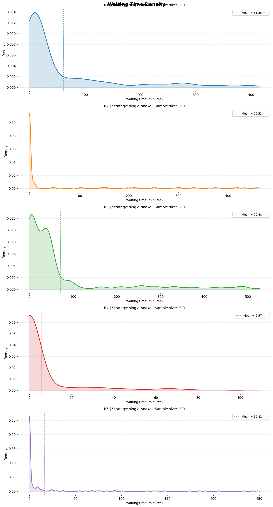
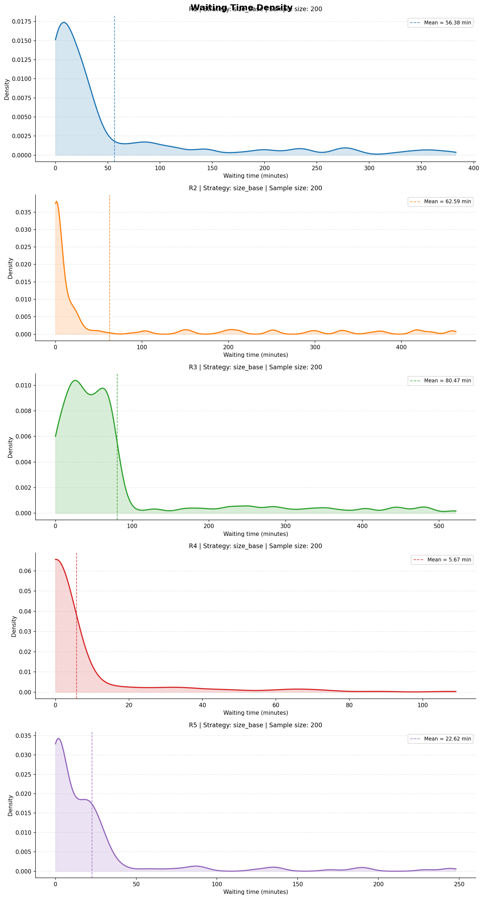
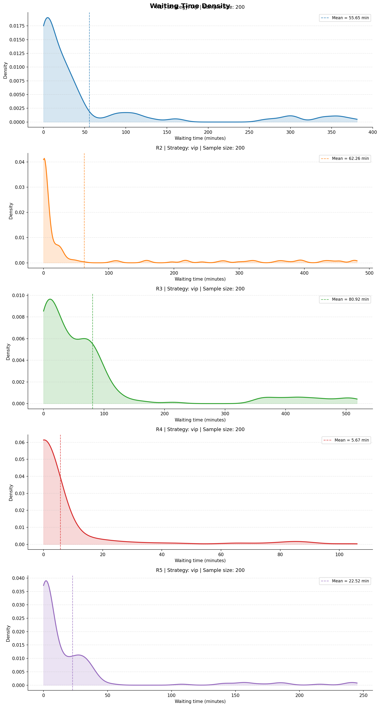

##### 5. Final Recommendation

Based on the simulation data, the optimal operational logic is summarized in the following decision matrix:

| Condition | Recommended Strategy | Rationale |
| ------ | ------ | ------ |
| High-Pressure | Single Snake | Lowest average wait time and queue length; best at suppressing "runaway" congestion. |
| Low-Pressure | Any Strategy | All strategies deliver near-zero waiting (~0.42m). Operational simplicity is the priority. |
| Overall Logic | Single Snake | The  Safest Default . It offers a ~9% performance advantage during peaks without a low-pressure disadvantage. |

#### 6.3 Baseline vs More VIP Scenario: Priority Pressure

This section is a paired comparison between the baseline VIP scenario and a More VIP scenario. The baseline condition uses the normal-demand VIP dataset, while the new scenario increases the VIP proportion and keeps the same general restaurant scale, table categories, customer volume, and fixed dining-time setting. The purpose of this pair is to isolate whether increasing the number of priority customers improves overall queue performance, or whether it only changes which customers receive earlier service under the same physical capacity.

##### 1 Executive Summary for This Part

This evaluation synthesizes the core findings of a simulation comparing a "Baseline" scenario (20% VIP proportion) with a "More VIP" scenario (50% VIP proportion). The data confirms a state of  Global Efficiency Invariance : despite a 150% increase in the VIP segment, system-wide performance metrics—total throughput and aggregate wait times—remain strictly static. These results indicate that global efficiency is fundamentally dictated by physical system capacity rather than the nuances of customer segmentation or priority logic.

##### 2 Analytical Framework

To evaluate the strategic impact of queue management, we utilize two primary operational lenses:

| Decision Lens | Arrival Condition | Main Interpretation |
| ------ | ------ | ------ |
| High-Pressure Resilience | Short interval / concentrated arrivals | Measures the system's ability to suppress sharp waiting-time escalation. |
| Low-Pressure Efficiency | Long interval / dispersed arrivals | Evaluates whether the system maintains a "near-zero wait" and stable flow. |

Metric Prioritization:  Instead of relying solely on occupation rates, this report prioritizes  Waiting-Time Density  and  Average Queue Length . These metrics provide a more accurate diagnostic of the customer experience, revealing the distribution of delays and the persistence of congestion that simple utilization figures often mask.

##### 3 Resource Utilization Efficiency

Analysis of internal capacity across both scenarios reveals a hard ceiling on operational performance.

* System-Wide Occupation:  The  Overall Occupation Rate for R1  remains fixed at  65.2% , regardless of whether the VIP proportion is 20% or 50%.
* Structural Bottleneck:  The  Table Utilization Rate for Table C  peaks at  95.3%  in both simulations.


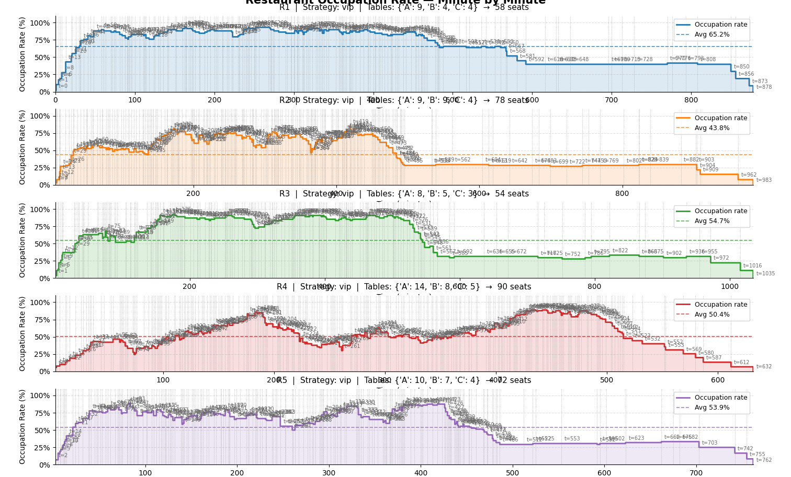
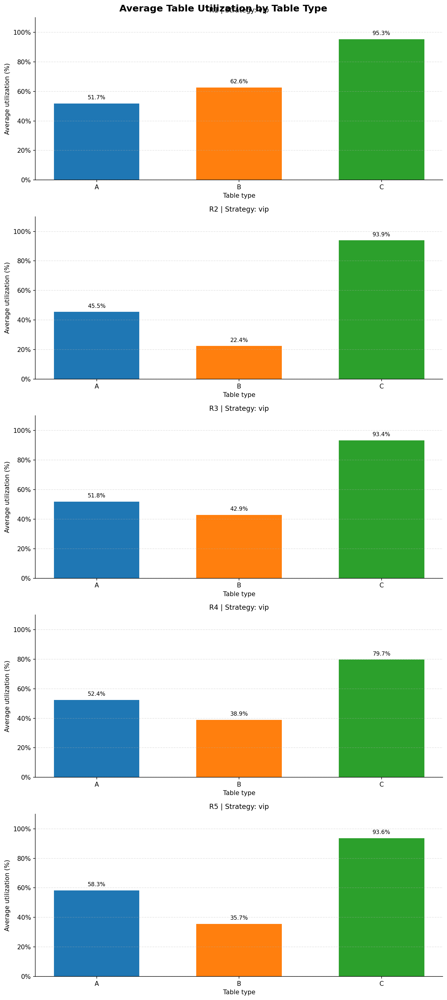

Strategic Insight:  Table C represents a structural hardware bottleneck. The data confirms that no amount of software-based priority shifting can bypass the physical unavailability of specific table resources. The system is capacity-constrained, not priority-constrained.

##### 4 Queue & Waiting Experience

A contrast of customer-side metrics reveals that the aggregate wait remains indifferent to the VIP ratio.

* Mean Waiting Time (R1):  Recorded at  55.65 minutes  in both scenarios (as visualized in the baseline density distribution).
* Average Queue Length (R1):  Remains steady at  12.66 groups .

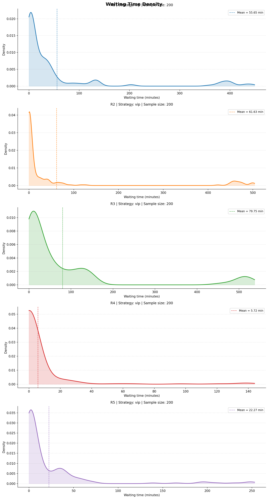
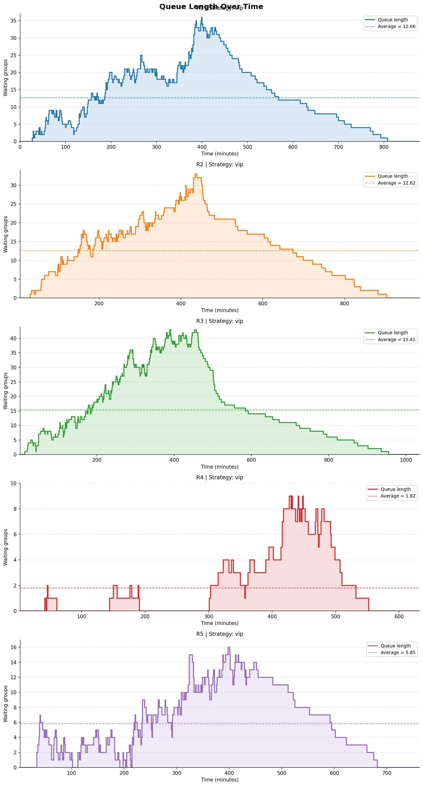

The "Wait-Time Paradox":  While the identity of the customer in the seat changes (favoring VIPs), the  Table Turnover Rate  remains stagnant because service times and table counts are constant. While individual VIPs may perceive a faster entry, the aggregate system does not clear the queue any faster.

##### 5 Structural Analysis: Why Global Metrics Remain Static

The invariance observed when increasing VIPs from 20% to 50% is driven by three technical factors:

* Fixed Capacity:  Table counts act as an unyielding hard constraint.
* Arrival Invariance:  The total volume and pattern of demand are identical in both simulations.
* Priority Dilution:  This is the most critical strategic takeaway. As the VIP proportion increases toward 50%, the mathematical advantage of priority is diluted. If half the guest base is "priority," the priority queue itself becomes a new bottleneck, effectively nullifying the benefit of the status.
* Re-shuffling vs. Reduction:  Priority strategies only  re-shuffle  the order of service; they do not increase the  rate  of service.

##### 6 Final Recommendation

Strategic Outlook:

* Marketing vs. Operations:  Management must view VIP scaling exclusively as a  loyalty marketing tool  to manage perception. It is not an operational tool and will not resolve congestion.
* The Operational Mandate:  For high-pressure arrival windows, the  "Single Snake"  strategy is the strongest resilience option. The data shows that Single Snake reduces average wait times by approximately  9%  (136.94 min) compared to VIP-based strategies (150.36 min) under extreme pressure.
* Policy Direction:  Do not invest operational resources into segmenting queues during peak hours; instead, implement a Single Snake baseline to maximize the service rate and suppress queue escalation.

#### 6.4 Baseline vs More Small Groups Scenario: Table-Category Bottleneck

This section is a paired comparison between the baseline group-size mix and a More Small Groups scenario. The baseline condition uses the normal customer-size distribution, while the new scenario increases the proportion of 1-2 person groups and keeps the same restaurant scale, strategy set, table-category structure, and fixed dining-time setting. The purpose of this pair is to test whether strict table-category matching becomes inefficient when demand is concentrated in one customer-size segment.

##### 1 Executive Summary for This Part

In scenarios where 1-2 person groups represent 90% of the customer mix, the choice of queuing strategy dictates the system's ability to handle arrival volatility. This analysis finds that while extreme pressure (short-interval arrivals) causes significant delays across all models, the  Single Snake  strategy demonstrates superior  High-Pressure Resilience . By utilizing "stochastic pooling"—allowing the dominant customer segment to access any available capacity—Single Snake suppresses the escalation of waiting times more effectively than rigid, size-based models.

The Bottom Line:  Single Snake is the most resilient strategy for restaurants facing concentrated arrival waves. It yields an average wait time of 136.94 minutes under high pressure, outperforming the Size-based strategy (150.73 minutes) by limiting the catastrophic queue buildup inherent in rigid allocation.

##### 2 Analytical Framework

To determine operational viability, we evaluate performance through two distinct decision lenses:

* High-Pressure Resilience:  Measured during short-interval/concentrated arrivals to assess a strategy's ability to suppress sharp waiting-time escalation.
* Low-Pressure Efficiency:  Measured during long-interval/dispersed arrivals to ensure a frictionless, near-zero-wait experience.

| Key Metric | Definition | Purpose in Analysis |
| ------ | ------ | ------ |
| Average Wait Time | Mean customer wait from arrival to seating. | Primary indicator of service speed and customer burden. |
| Average Queue Length | Mean number of groups waiting in the system. | Indicates if congestion is temporary or persistent. |
| Waiting-time Density | Statistical distribution of wait times. | Shows the burden on the majority of the customer base. |
| Occupation Rate | Percentage of total seats occupied. | Diagnostic of flow efficiency and resource utilization. |

##### 3 Wait Time and Queue Analysis

Analysis of the simulation data reveals that Single Snake provides the most robust defense against arrival surges. While no strategy completely eliminates congestion under extreme concentration, Single Snake maintains a lower threshold of failure.

| Strategy | Avg Wait Time (Short) | Avg Queue Length (Short) | Short Growth (%)* |
| ------ | ------ | ------ | ------ |
| Single Snake | 136.94 min | 31.21 groups | +220.9% |
| Size-based | 150.73 min | 35.44 groups | +230.9% |
| VIP | 150.36 min | 35.40 groups | +231.2% |
| *Growth relative to the Medium/Baseline condition. |  |  |  |

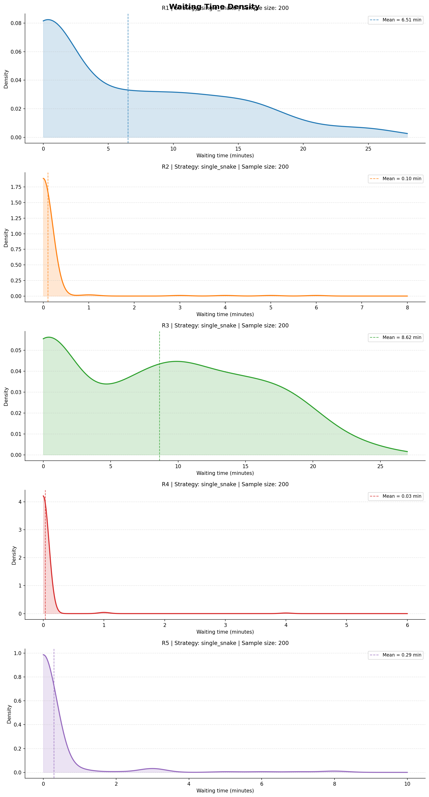
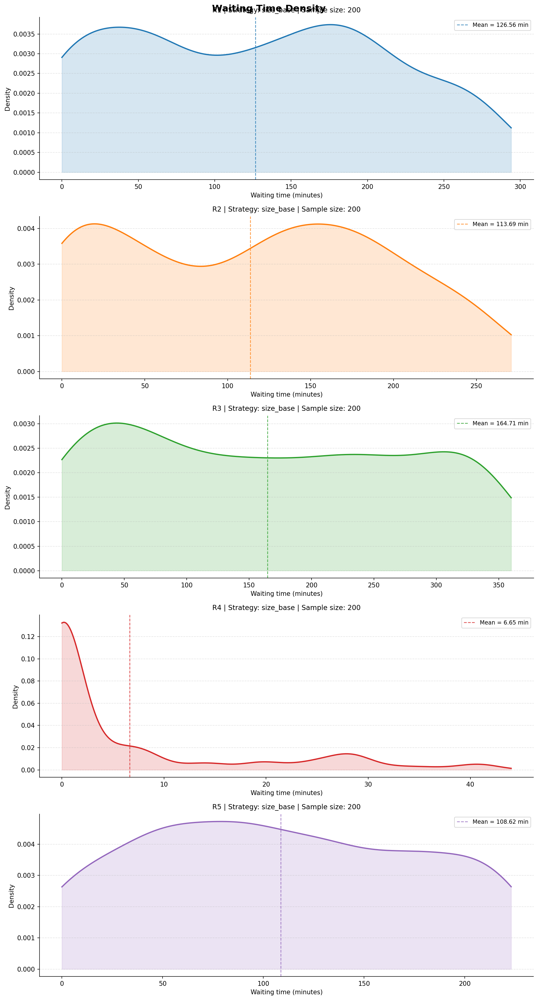

The Mechanism of Resilience:  The Single Snake strategy reduces average wait times by approximately 9.1% compared to the Size-based model. More importantly, it achieves an 11.9% reduction in average queue length. Because Single Snake pools all arrivals into one shared line, it avoids the "mismatch" penalty of Size-based systems, where small groups wait in an overloaded queue while larger tables sit idle.

##### 4 Resource Utilization Efficiency

A deep dive into Restaurant R1 data highlights the "Utilization Paradox." In a Size-based system, high seat counts do not guarantee throughput if the queue logic is too rigid.

* Single Snake (R1):  Maintains an average table utilization of  89.8% , effectively converting capacity into service.
* Size-based (R1):  Occupation rate collapses to  30.8% .

This disparity is driven by the  Type C Paradox : In a 90% small-group surge, Size-based logic forbids 1-2 person groups from occupying 5-6 person tables (Type C). In R1 simulations, this resulted in  0.0% utilization for Table Type C , representing total resource waste while the small-group queue surged to over 35 groups. Single Snake's capacity flexibility ensures these resources are pooled to absorb the 90% majority.

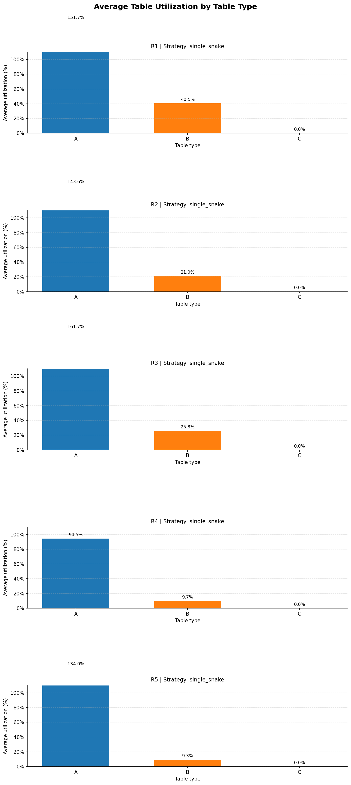
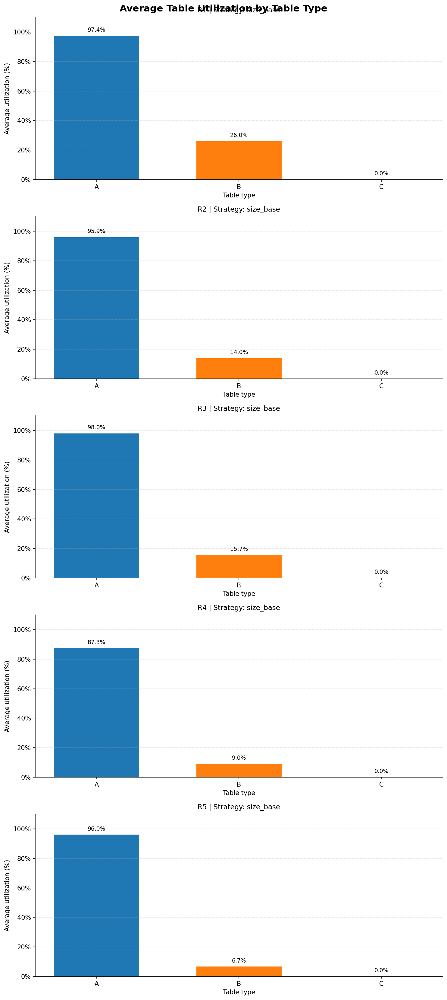

##### 5 Final Recommendation

The "Senior Analyst" recommendation prioritizes the suppression of system failure during peak periods.

| Criterion | Best Strategy | Reasoning |
| ------ | ------ | ------ |
| High-Pressure Resilience | Single Snake | Lowest wait-time growth (+220.9%) and smallest queue burden. |
| Low-Pressure Efficiency | Size-based | Marginally higher reduction rate (99.06%), though practically negligible. |

Final Command:   Single Snake should be the default operating logic. It offers the strongest protection against waiting-time escalation (+220.9% growth vs. +230.9% for Size-based) and maintains operational fluidity across all arrival densities without the resource waste seen in size-restricted queuing.

#### 6.5 Baseline vs Short/Long Arrival Interval Scenarios: Demand Intensity

This section treats arrival intensity as the controlled variable. The baseline condition represents the medium or normal arrival pattern, while the new scenarios compare compressed short-interval arrivals and dispersed long-interval arrivals. The restaurant scale, implemented strategies, table categories, and fixed dining-time setting remain comparable. The purpose of this pair is to test whether strategy choice matters more under high-pressure arrival waves than under low-pressure arrival patterns.

##### 1. Executive Summary for This Part
 
The revised interpretation is customer-flow oriented. The central question is not whether unused table capacity should be reallocated, but which queueing strategy keeps most customers from waiting too long under different arrival-density conditions. Short interval represents a high-pressure situation because many groups arrive in a compressed time window. Long interval represents a low-pressure situation because arrivals are spread out and the restaurant has more time to absorb demand. The medium or baseline condition is treated only as the reference point between these two stress extremes.
 
The main finding is clear. Under short-interval pressure, all strategies suffer a major increase in waiting time, so none of them fully prevents congestion. However, Single Snake performs best among the tested short-interval strategies: its average wait time is 136.94 minutes, compared with 150.73 minutes for Size-Based and 150.36 minutes for VIP. Its average queue length is also lower, at 31.21 waiting groups compared with about 35.4 for the other two strategies. This suggests that Single Snake has the strongest high-pressure resilience in the current simulations.
 
Under long-interval conditions, the result is different. All three strategies create an almost zero-waiting experience. Average wait times are only 0.42 to 0.43 minutes, and average queue lengths are 0.05 waiting groups for all three. In practical terms, Single Snake, Size-Based and VIP all achieve smooth low-pressure operation. The choice under low pressure therefore depends less on waiting-time reduction and more on operational simplicity or service-design goals.
 
**Bottom line: choose Single Snake when the restaurant expects a concentrated arrival wave. Under dispersed arrivals, any of the three strategies can deliver near-zero waiting, so the simplest rule is usually sufficient unless the restaurant has a specific reason to use priority or segmentation.**
 
##### 2. Analytical Framework
 
The part of the report separates two decision lenses. First, high-pressure resilience asks whether a strategy can slow the rapid build-up of waiting time when arrivals become highly concentrated. This is not judged only by table utilization, because high utilization can coexist with poor customer experience if the queue grows sharply. The stronger indicators are average wait time, average queue length, and whether the queue remains persistent across the run.
 
Second, low-pressure efficiency asks whether the strategy can keep customer flow nearly frictionless when arrivals are spread out. In that condition, the best strategy is not the one that maximizes table use, but the one that keeps waiting near zero while avoiding unnecessary operational complexity.
 
| Metric | Why it matters for this revised analysis | How it should be read |
|--------|------------------------------------------|----------------------|
| Average wait time | Direct customer-experience measure. | Lower is better, especially under short-interval pressure. |
| Average queue length | Shows whether congestion is temporary or persistent. | Lower and shorter-lived queues indicate stronger resilience. |
| Waiting-time density | Shows whether most customers wait little or whether many customers face long waits. | The left side of the distribution matters more than a single mean. |
| Table utilization / occupation rate | Used as a diagnostic of flow, not as a recommendation to change table counts. | High values can explain pressure; low values under long intervals support smooth operation. |
 
This distinction matters because a strategy can look efficient from a resource perspective while still being weak from a customer perspective. The present report therefore prioritizes waiting and queue outcomes over capacity-allocation conclusions.
 
##### 3. High-Pressure Resilience: Short-Interval Arrivals
 
###### 3.1 Core comparison under high pressure
 
In the short-interval scenario, arrival density is the stress factor. The restaurant faces a concentrated wave of customers, so the operational challenge is to prevent waiting time from growing sharply for most groups. The comparison across the three short-interval datasets shows that Single Snake is the strongest option, although the difference should be interpreted as relative resilience rather than complete congestion elimination.
 
| Short-interval dataset | Avg wait time (min) | Avg queue length (groups) | Avg table utilization (%) | Avg occupation rate (%) | Interpretation |
|------------------------|---------------------|---------------------------|---------------------------|-------------------------|----------------|
| single_short | 136.94 | 31.21 | 56.35 | 54.44 | Best short-pressure result. Waiting remains high, but queue build-up is smaller. |
| size_base_short | 150.73 | 35.44 | 57.63 | 55.71 | Higher utilization does not translate into better customer waiting. |
| vip_short | 150.36 | 35.40 | 57.76 | 55.83 | Priority structure does not reduce overall waiting under compressed arrivals. |
 
Single Snake reduces average waiting time by about 9.1% compared with Size-Based and about 8.9% compared with VIP. It also reduces average queue length by about 11.9% compared with both alternatives. These differences are meaningful because the table utilization and occupation rates are very similar across the three short-interval cases. In other words, Single Snake is not simply "less busy"; it handles the same pressure with a smaller customer queue.
 

 
###### 3.2 Queue build-up is the key resilience signal
 
The average queue-length chart confirms the same pattern. Under short intervals, queue size rises from almost zero in the long cases to more than 30 waiting groups in the short cases. Single Snake records the lowest short-interval queue average. This matters because queue length is the mechanism through which waiting time accumulates. Once the queue becomes large and persistent, later arrivals inherit the delay created by earlier arrivals.
 
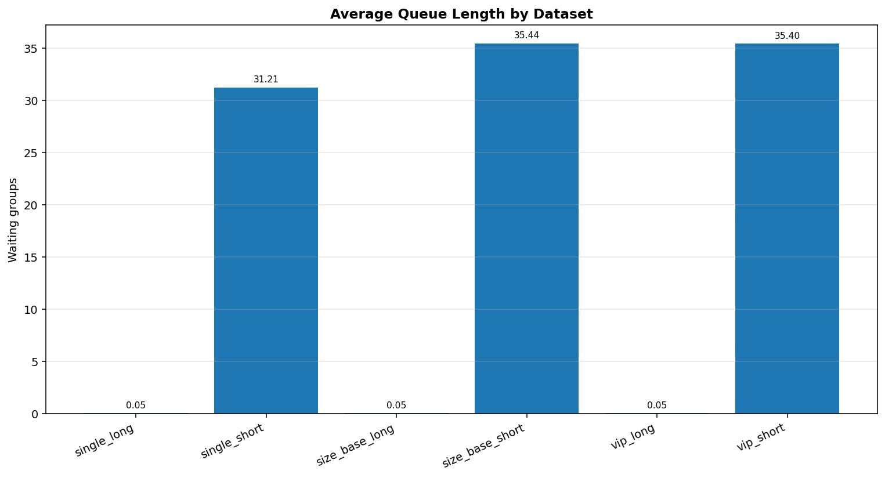
 
###### 3.3 Detailed reading of Single Snake under short pressure
 
The Single Snake short-interval time-series plot shows why this strategy should be described as relatively resilient, not fully safe. In most replications, the queue rises quickly during the early arrival wave, reaches a high peak, and then gradually clears. The best replication, R4, has a much lower average queue and lower mean waiting time, but the other runs still show substantial congestion. This indicates that Single Snake is better at suppressing queue growth than the other short strategies, but it remains vulnerable when the arrival burst is too compressed.
 
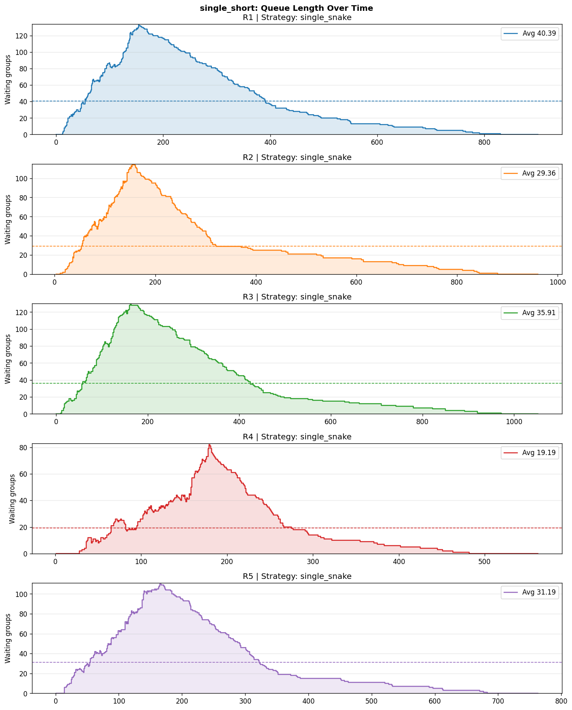
 
The practical interpretation is that Single Snake gives the restaurant the best chance of limiting the damage during a high-pressure wave. It creates one shared queue, which helps reduce mismatch between customer groups and service opportunities. However, when arrivals are extremely compressed, even the better queueing rule cannot fully offset the pressure. The strategy choice improves the outcome, but the arrival pattern still dominates the system.
 
###### 3.4 Waiting-time density: reducing the majority burden
 
Waiting-time density adds a more customer-centered view. The mean waiting time for Single Snake short arrivals is still high, but the distribution shows that the strategy keeps a meaningful mass of customers at lower waiting times compared with a situation where the whole distribution shifts further right. This is the specific sense in which it reduces the burden for the majority of customers: it does not eliminate long waits, but it limits the severity of the queue relative to the other tested short-interval strategies.
 
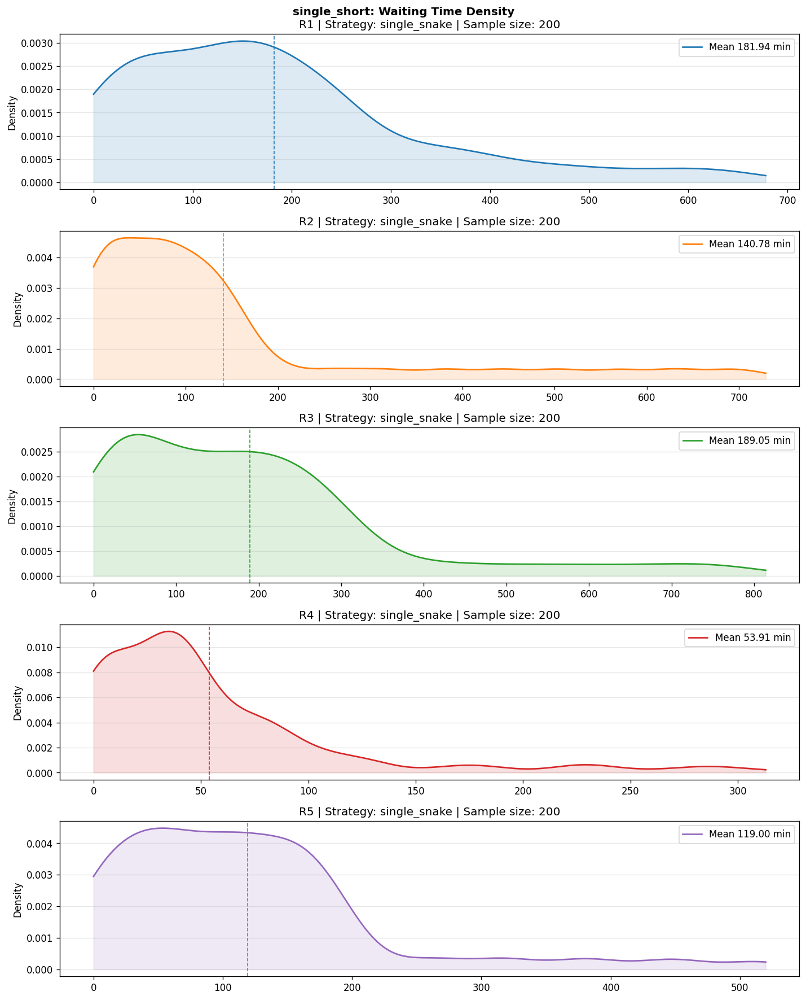
 
**Therefore, the correct high-pressure conclusion is not "Single Snake solves the queue." The stronger and more defensible conclusion is: Single Snake is the most resilient tested strategy under compressed arrivals because it produces the lowest average wait time and the lowest average queue length while operating under a similar utilization level.**
 
##### 4. Role of the Medium/Baseline Condition
 
The medium-density baseline is used as the quantitative reference point between two stress extremes. Long interval represents dispersed arrivals; short interval represents compressed arrivals. The relevant question is not whether lower utilization suggests a different table mix. The relevant question is how much each strategy changes customer waiting time when the same restaurant system is exposed to lower or higher arrival pressure.
 
The comparison below uses the average waiting time from each strategy under Long, Medium/Baseline and Short arrival densities. Net change is calculated as T_short - T_medium and T_long - T_medium. Because the original waiting-time outputs are in minutes, the net changes are also converted into seconds for easier interpretation. The percentage change is calculated relative to the medium baseline.
 
| Strategy | T_long (min) | T_medium (min) | T_short (min) | T_s - T_m (sec) | Short growth (%) | T_l - T_m (sec) | Long reduction (%) |
|----------|--------------|----------------|---------------|-----------------|------------------|-----------------|-------------------|
| Single Snake | 0.42 | 42.67 | 136.94 | +5,656 | +220.9% | -2,535 | 99.02% |
| Size-based | 0.43 | 45.55 | 150.73 | +6,311 | +230.9% | -2,707 | 99.06% |
| VIP | 0.43 | 45.40 | 150.36 | +6,297 | +231.2% | -2,698 | 99.05% |
 
This table changes the interpretation of the baseline section. Under high pressure, Single Snake has the smallest waiting-time growth rate: +220.9% from the medium baseline to the short-arrival case. Size-based grows by +230.9%, while VIP grows by +231.2%. On the strict resilience criterion, the lowest growth rate is the strongest result; therefore, Single Snake is the most resilient strategy against compressed arrivals. It does not prevent congestion, but it suppresses the escalation of waiting time better than the other two strategies.
 
Under low pressure, the reduction rate is extremely high for all three strategies. Size-based has the largest proportional reduction from medium to long arrivals, at 99.06%, followed very closely by VIP at 99.05% and Single Snake at 99.02%. If the criterion is purely numerical, Size-based is marginally the best low-pressure flow-efficiency strategy. However, the gap is less than 0.05 percentage points, so the practical conclusion is that all three strategies reach a near-zero-wait state when arrivals are sufficiently dispersed.
 
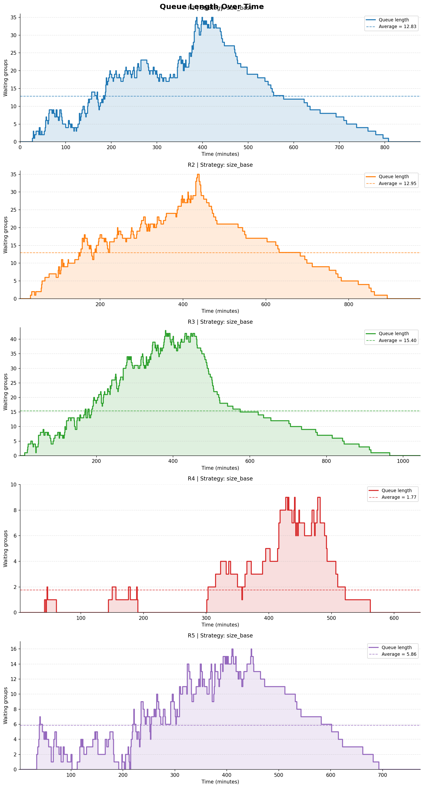
 
**Therefore, the baseline condition is not a recommendation target by itself. Its value is analytical: it makes the high-pressure and low-pressure conclusions measurable. Compared with medium arrivals, Single Snake shows the lowest short-arrival growth rate and is therefore the strongest high-pressure resilience option. Compared with medium arrivals, Size-based shows the largest long-arrival reduction rate, but the difference is so small that all strategies can be described as operationally smooth under low pressure.**
 
##### 5. Low-Pressure Efficiency: Long-Interval Arrivals
 
###### 5.1 Core comparison under low pressure
 
The long-interval condition represents dispersed arrivals. Here the operational goal is different: the best strategy is the one that allows customers to be seated with almost no waiting and keeps the restaurant flow stable. The results are extremely close across all three strategies.
 
| Long-interval dataset | Avg wait time (min) | Avg queue length (groups) | Avg table utilization (%) | Avg occupation rate (%) | Interpretation |
|----------------------|---------------------|---------------------------|---------------------------|-------------------------|----------------|
| single_long | 0.42 | 0.05 | 25.96 | 25.17 | Near-zero wait. Smooth operation. |
| size_base_long | 0.43 | 0.05 | 25.96 | 25.17 | Near-zero wait. No practical difference from Single Snake. |
| vip_long | 0.43 | 0.05 | 25.96 | 25.17 | Near-zero wait. Priority logic does not harm the average, but does not improve it either. |
 
The difference between 0.42 and 0.43 minutes is operationally negligible. Using the strict percentage-reduction criterion from Section 4, Size-based is marginally the strongest low-pressure option because its waiting time falls by 99.06% from the medium baseline. However, VIP reaches 99.05% and Single Snake reaches 99.02%, so the practical conclusion remains that all three strategies achieve a near-zero-waiting experience under long-interval arrivals.
 
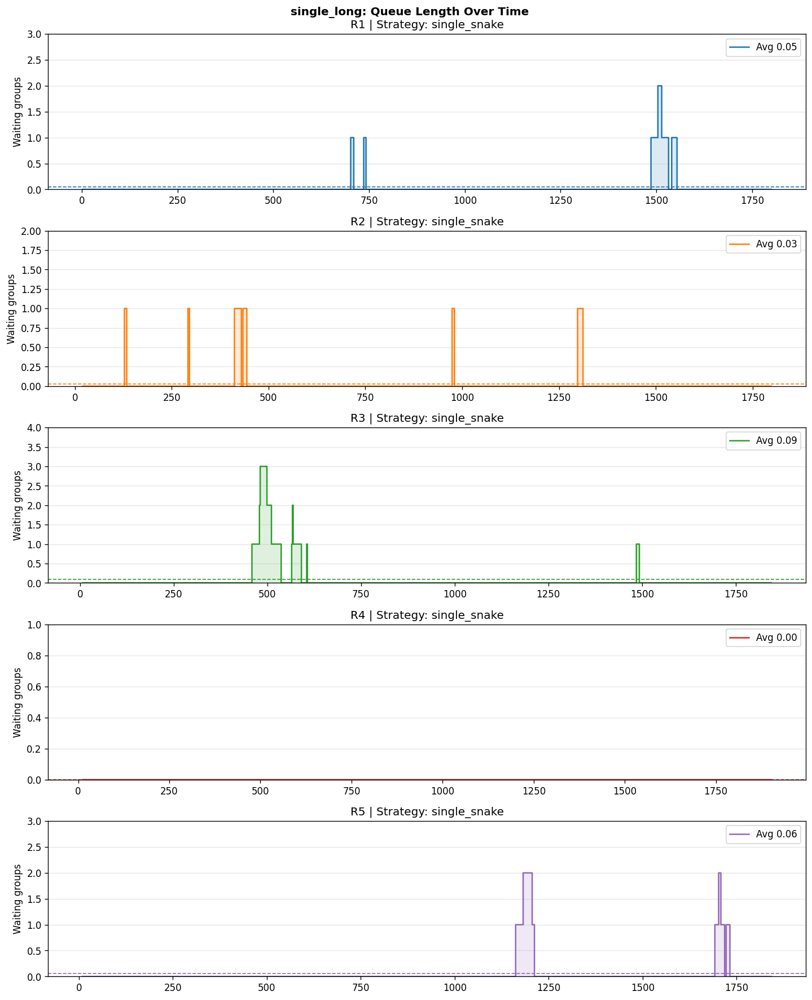
 
###### 5.2 Why the long-interval scenario is fundamentally different
 
The long-arrival waiting-time density is concentrated close to zero. This is the clearest evidence of low-pressure efficiency. In this condition, the system has enough time between arrivals to absorb demand before the next group arrives. As a result, queueing strategy becomes less decisive. The restaurant does not need a powerful congestion-control mechanism because congestion rarely forms in the first place.

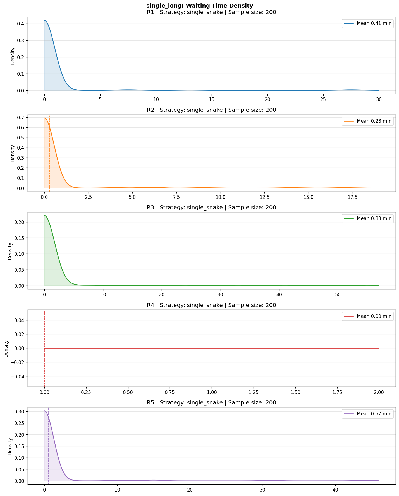
 
**The implication is not that long-arrival restaurants should reduce tables or redesign capacity. The relevant conclusion is simpler: when customer arrivals are sufficiently dispersed, the tested strategies all keep the system smooth. In this situation, operational simplicity becomes more important than aggressive queue management.**
 
##### 6. Utilization as a Supporting, Not Leading, Indicator
 
The utilization charts remain useful, but they should not drive the main conclusion. Under short intervals, utilization and occupation are higher, yet the customer experience is worse because queues grow sharply. Under long intervals, utilization and occupation are lower, yet customer experience is better because waiting is almost zero. This shows that utilization is a diagnostic variable, not the primary performance measure for this question.
 
Table-type utilization also shows that some table categories are used more heavily than others, especially Table C. This helps explain why congestion can appear even when the overall restaurant is not at full theoretical capacity. However, the report does not convert this into a table-mix recommendation, because the requested focus is strategy performance under fixed restaurant conditions.
 
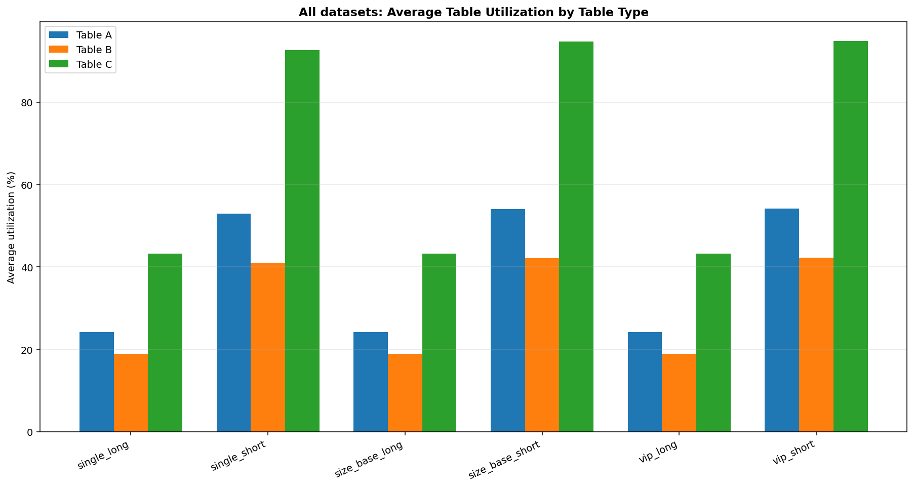
 
##### 7. Final Recommendation
 
| Question | Best-supported answer | Reason |
|----------|----------------------|---------|
| High-Pressure Resilience | Single Snake | It produces the lowest short-interval average wait time and queue length while facing similar utilization pressure. |
| Low-Pressure Efficiency | Size-based is marginally best by percentage reduction, but all three are practically acceptable. | Size-based reduces waiting by 99.06% from medium to long, while VIP reaches 99.05% and Single Snake reaches 99.02%. |
| Overall operating logic | Use Single Snake as the safer default when arrival density is uncertain or likely to be concentrated. | It performs best under pressure and does not create a disadvantage under low pressure. |
 
The strongest overall default strategy is therefore Single Snake. It is not because it maximizes utilization, but because it offers the best balance across the two customer-flow conditions: it has the lowest short-pressure growth rate at +220.9% and still delivers near-zero waiting under long-arrival conditions. Size-based is marginally strongest under low pressure by reduction rate, but the low-pressure differences are too small to outweigh the clearer advantage of Single Snake under compressed arrivals.
 
This conclusion should be stated carefully. The simulation does not prove that Single Snake will eliminate queues in every high-pressure situation. It shows that, among the tested alternatives and using the provided output charts, Single Snake reduces the severity of the queue more effectively than the other strategies when arrivals are highly concentrated.


#### 6.6 Additional Proposed Case Pairs

The completed experiments above provide implemented evidence for the main baseline-centered comparisons. To further match the Topic C suggestion of 5-6 paired scenarios, the following additional case pairs are proposed as future extensions. They are not reported as completed experiments; instead, they define clear controlled comparisons that could be implemented with the same CSV input format and simulation pipeline.

| Pair concept | Controlled variable | Real-world scenario | Implementation plan | Expected result |
|---|---|---|---|---|
| Baseline vs fewer large tables | Number of Type C tables | A small cafe has limited space and removes large tables to fit more small tables. | Keep the same customer arrival file as the baseline, but reduce `C` table count in the restaurant CSV while leaving strategy, customer volume, and dining-time mode unchanged. | Large parties should wait longer, max queue length for large-group demand should increase, and total occupation may become more sensitive to table mix. |
| Baseline vs table-capacity rebalancing | Table distribution across A/B/C | A restaurant redesigns its floor plan after observing that one table category is consistently overloaded. | Keep total table count similar, but shift some capacity from underused categories to the bottleneck category, then compare summary metrics with the baseline. | If the bottleneck table type receives more capacity, average wait time and max queue length should fall for the affected group-size segment. |
| Baseline vs VIP + single-snake hybrid | Queue policy | A restaurant wants both perceived fairness from a shared queue and limited priority treatment for loyalty members. | Add a hybrid strategy where most groups wait in one shared queue, but VIP groups receive a small priority boost only when a suitable table is available. | VIP waiting time may decrease, but the system should be checked for fairness loss and whether non-VIP average wait time increases. |
| Baseline vs customer walkaway behavior | Customer abandonment rule | In real peak-hour restaurants, some customers leave if the expected wait is too long. | Add a maximum patience threshold to customer records, then mark groups as unserved if their wait exceeds that threshold. | Average wait among served customers may decrease, but total served groups and customer satisfaction interpretation become more complex. |
| Baseline vs table-sharing policy | Seating rule | A dim sum hall or crowded cafe may allow unrelated small groups to share a large table. | Extend the table model from one-group-per-table to partial table occupancy, then allow compatible small groups to share unused seats. | Seat utilization should increase and small-group wait time may decrease, but the model becomes more complex and may reduce customer comfort in some real contexts. |

These proposed pairs show how the current project could be extended without changing its core modeling approach: each pair keeps most inputs stable and changes one main factor, making the resulting trade-off easier to interpret.

#### 6.7 Limitation Analysis

The case studies are useful for comparing strategy behavior, but several limitations remain. First, all datasets are synthetic. They are helpful for controlled testing, but they cannot fully represent real restaurant behavior, such as meal-period peaks, group cancellations, walk-away customers, or customers changing party size.

Second, the case analysis uses fixed dining time. This makes the strategies easier to compare, but real dining time is variable and affected by menu type, service speed, and customer behavior. A more realistic model would run repeated simulations with random dining time and compare the average result across multiple random seeds.

Third, the current table-category model is rigid. The MoreA case shows that strict matching between party size and table category can create bottlenecks when demand is concentrated in one category. A future version could allow controlled fallback rules, such as seating a small group at a larger table after a maximum waiting threshold.

Fourth, the model assumes all customers eventually wait until they are served. In real restaurants, long waits may cause customers to leave. Adding abandonment behavior would make the queue simulation more realistic and would also change how waiting-time results should be interpreted.

Finally, the available testing outputs are not equally detailed across all cases. The long/short and MoreA cases include processed CSV summaries that support exact numerical comparison, while the baseline and MoreVIP cases rely more heavily on generated figures and input-distribution analysis. For a stronger evaluation, future tests should export the same summary metrics for every case.

### 7. Topic C Requirements Checklist

| Topic C requirement | Where addressed | Status |
|---|---|---|
| Define customer arrival scenarios with group size, arrival time, and dining duration | Sections 3.2-3.3, 5.2, README input schema, `Testing/` CSV files | Addressed |
| Define restaurant settings with tables and queues | Sections 3.2, 3.4, 5.2, restaurant CSV files | Addressed |
| Use simple file input/output | Sections 5.1-5.2, README run instructions, `Modeling&Coding/io_file.py` | Addressed |
| Simulate arrivals, waiting queues, table release, and seating decisions | Sections 3.4, 5.3-5.4, strategy modules | Addressed |
| Track dining duration and output wait-time metrics | Sections 3.3, 5.5, output summaries | Addressed |
| Output queue length and utilization evidence | Sections 5.5-5.8, Section 6 figures and tables | Addressed |
| Include basic input validation | Section 5.2, Section 5.7, pytest validation tests | Addressed |
| Provide case studies comparing restaurant settings or strategy behavior | Section 6.1-6.5 implemented comparisons; Section 6.6 proposed extensions | Addressed with implemented and proposed pairs clearly separated |
| Discuss trade-offs, limitations, and future improvements | Sections 6.2-6.7 | Addressed |
| Provide repository and demo evidence for reproduction | Submission Links section | GitHub provided; demo link to be added |

### References

ArchDaily. (2024). *Beyond private dining: Exploring the communal table as public space infrastructure*. https://www.archdaily.com/1034907/beyond-private-dining-exploring-the-communal-table-as-public-space-infrastructure

Gorilla Group Limited. (n.d.). *THE GULU official website*. https://web.thegulu.com/

Gross, D., Shortle, J. F., Thompson, J. M., & Harris, C. M. (2018). *Fundamentals of queueing theory* (5th ed.). Wiley.

KeeTa. (n.d.). *KeeTa app*. https://apps.apple.com/hk/app/keeta/id1666524103

Little, J. D. C. (1961). A proof for the queuing formula: L = λW. *Operations Research*.

Meituan. (n.d.). *Official website*. https://about.meituan.com/en

Meituan Tech. (2020). *Meituan delivery dispatch algorithm*. https://tech.meituan.com/2020/07/16/meituan-delivery-dispatch-algorithm.html

Mwee. (n.d.). *Meiwei Bu Yong Deng official website*. https://mwee.cn/

Qminder. (n.d.). *Queueing theory guide*. https://www.qminder.com/blog/queue-management/queuing-theory-guide/

Tiwari, S. K., & Gupta, V. K. (2016). *M/M/S queueing theory model to solve waiting line and to minimize estimated total cost*. *International Journal of Science and Research*.

Wharton Faculty. (2017). *At your service on the table: Impact of tabletop technology on restaurant performance*. https://faculty.wharton.upenn.edu/wp-content/uploads/2017/09/2017.9.10_Tabletop_For_Submission_WithNames.pdf

Wikipedia contributors. (n.d.). *Table sharing*. Wikipedia. https://en.wikipedia.org/wiki/Table_sharing
